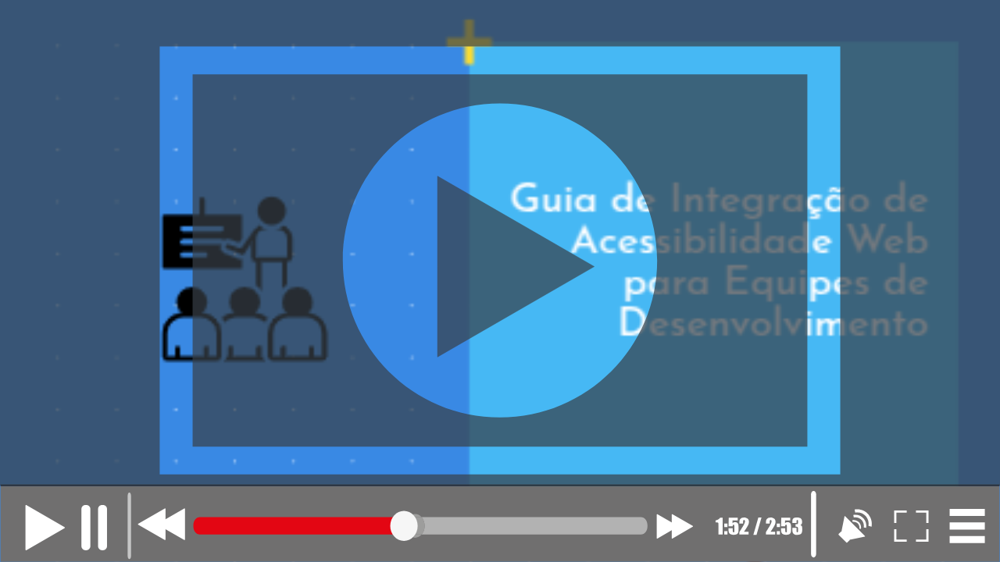

# 🚀 Guia de Integração de Acessibilidade Web para Equipes de Desenvolvimento: Construindo a Web para Todos ✨

**Olá, Pessoa Desenvolvedora!** (ou interessada em desenvolvimento) 👋 

Este é **Guia de Integração de Acessibilidade Web para Equipes de Desenvolvimento**, feito de desenvolvedora para desenvolvedores, uma proposta prática para integrar a acessibilidade no seu cotidiano de desenvolvimento. Este projeto nasceu a partir do meu Trabalho de Conclusão de Curso (TCC) objetivando seu compartilhamento com a comunidade tech, para que eu possa entender o nível de aceitação e aplicabilidade deste Guia. 🌍

🎥 Vídeo demonstrativo:

## Qual o Propósito deste Guia? 🤔

Integrar a acessibilidade em **em etapas fundamentais** do desenvolvimento web (escrita de código, execução, revisão e publicação). Este guia visa ser **simples**, **gratuito** e dispor de **ferramentas que já são conhecidas no dia a dia dos desenvolvedores**. 🚀  Com ele, você terá um guia para:

*   **👩‍💻 Desenvolvimento:** Utilizar Linters para identificar questões de acessibilidade no código.
*   **⚙️ Execução:** Empregar ferramentas de navegador e DevTools para testes visuais e práticos.
*   **🫂 Testes Manuais:**  Simular a experiência de usuários com diversas necessidades para complementar os testes automatizados.
*   **📜 Conformidades Legais:** Como utilizar a ABNT NBR 17225 a nosso favor  
*   **✅ Pull Requests:** Implementar um Checklist para garantir a acessibilidade em cada entrega de código.
*   **📦 Publicação:** Automatizar verificações de acessibilidade no pipeline de CI/CD para entregas contínuas e acessíveis.

Este Guia surgiu a partir de um estudo sobre acessibilidade web em ambientes educacionais, que mostrou que muitos problemas só são identificados após a produção, principalmente por ferramentas automatizadas. O objetivo do Guia é integrar essas ferramentas na etapa de desenvolvimento, ajudando os desenvolvedores a reduzir erros antes da fase de testes com usuários e especialistas. Assim, questões mais complexas de acessibilidade podem ser analisadas com mais atenção nessa etapa.

## Documentação

[🔗 Inicie aqui](./docs/1.0.Introducao.md)

## Quem está por trás deste Guia? 🤓

*   **Eirene Fireman:** Desenvolvedora Web, graduanda em Ciência da Computação pela UFAL e entusiasta em acessibilidade web. [LinkedIn](https://www.google.com/url?sa=E&source=gmail&q=LINK-DO-LINKEDIN-DA-EIRENE) | [GitHub](https://www.google.com/url?sa=E&source=gmail&q=LINK-DO-GITHUB-DA-EIRENE) | [Email](https://www.google.com/url?sa=E&source=gmail&q=EMAIL-DA-EIRENE)
*   **Professor Fábio Coutinho:** Docente da UFAL e orientador do projeto. [Currículo Lattes](https://www.google.com/url?sa=E&source=gmail&q=LINK-DO-LATTES-DO-FABIO)

## Seu feedback é muito importante para nós!

> **👉 Clique AQUI para Acessar o Formulário de Feedback [FORMULÁRIO DE FEEDBACK](https://forms.gle/U75FJSutNxZ2bwWG7) 👈**

Agradecemos se puder responder ao formulário e compartilhar sua perspectiva sobre:

*   Aplicabilidade do Framework no seu dia a dia 👍 ou 👎
*   Relevância e utilidade das ferramentas e técnicas propostas 💡
*   Sugestões de melhorias e aprimoramentos 🔧
*   Novas ideias e contribuições 🎁

---

**Vamos construir juntos uma web mais acessível e inclusiva! 💪**
