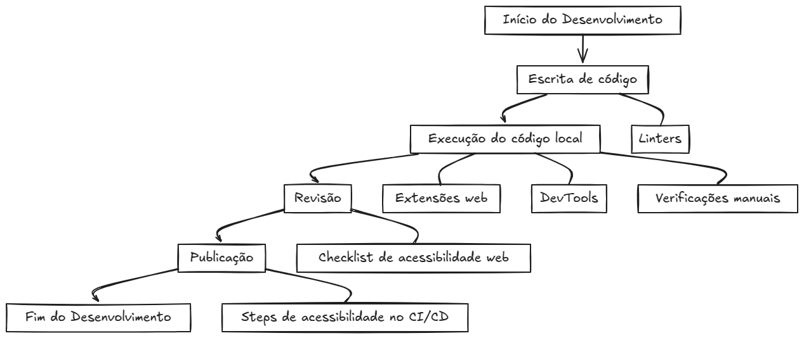

# 🚀 Guia de Integração de Acessibilidade Web para Equipes de Desenvolvimento: Construindo a Web para Todos ✨

**Olá, Pessoa Desenvolvedora!** (ou interessada em desenvolvimento) 👋 

Apresento o ** Guia de Integração de Acessibilidade Web para Equipes de Desenvolvimento**, uma proposta prática para integrar a acessibilidade em seus projetos desde o início! Este projeto nasceu a partir do meu Trabalho de Conclusão de Curso (TCC) e agora quero compartilhar com a comunidade tech, pois quero entender o nível de aceitação e aplicabilidade deste Guia. 🌍

**Qual o Propósito do Framework? 🤔**

Integrar a acessibilidade em **todas as etapas** do desenvolvimento web de maneira **simples**, **gratuita** e a partir de **ferramentas que já são conhecidas no dia a dia dos desenvolvedores**. 🚀  Com ele, você terá um guia para:

*   **👩‍💻 Desenvolvimento:** Utilizar Linters para identificar questões de acessibilidade no código.
*   **⚙️ Execução:** Empregar ferramentas de navegador e DevTools para testes visuais e práticos.
*   **🫂 Testes Manuais:**  Simular a experiência de usuários com diversas necessidades para complementar os testes automatizados.
*   **✅ Pull Requests:** Implementar um Checklist para garantir a acessibilidade em cada entrega de código.
*   **📦 Publicação:** Automatizar verificações de acessibilidade no pipeline de CI/CD para entregas contínuas e acessíveis.

**Sua Opinião é Valiosa!  💖**

Este Framework foi criado para **você**, desenvolvedor(a)!  Portanto, seu feedback é muito importante para mim! Agradeço se puder responder ao formulário e compartilhar sua perspectiva sobre:

*   Aplicabilidade do Framework no seu dia a dia 👍 ou 👎
*   Relevância e utilidade das ferramentas e técnicas propostas 💡
*   Sugestões de melhorias e aprimoramentos 🔧
*   Novas ideias e contribuições 🎁

**👉 Clique AQUI para Acessar o Formulário de Feedback [FORMULÁRIO DE FEEDBACK](https://www.google.com/url?sa=E&source=gmail&q=LINK-PARA-O-SEU-FORMULARIO) 👈** *(Lembre-se de substituir `LINK-PARA-O-SEU-FORMULARIO` pelo link do seu formulário, ok? 😉)*

**Quem Desenvolveu? 🤓**

*   **Eirene Fireman:** Desenvolvedora Web, graduanda em Ciência da Computação pela UFAL e entusiasta da acessibilidade. [LinkedIn](https://www.google.com/url?sa=E&source=gmail&q=LINK-DO-LINKEDIN-DA-EIRENE) | [GitHub](https://www.google.com/url?sa=E&source=gmail&q=LINK-DO-GITHUB-DA-EIRENE) | [Email](https://www.google.com/url?sa=E&source=gmail&q=EMAIL-DA-EIRENE)
*   **Professor Fábio Coutinho:** Docente da UFAL e orientador do projeto. [Currículo Lattes](https://www.google.com/url?sa=E&source=gmail&q=LINK-DO-LATTES-DO-FABIO)

**Vamos construir juntos uma web mais acessível e inclusiva! 💪**

**[Documentação Completa](./docs/1.Inicie_aqui.md)** *(Link para a documentação principal, se aplicável)*

---

✨ **A acessibilidade é um direito de todos. Seu feedback contribui para um futuro mais inclusivo!** ✨
