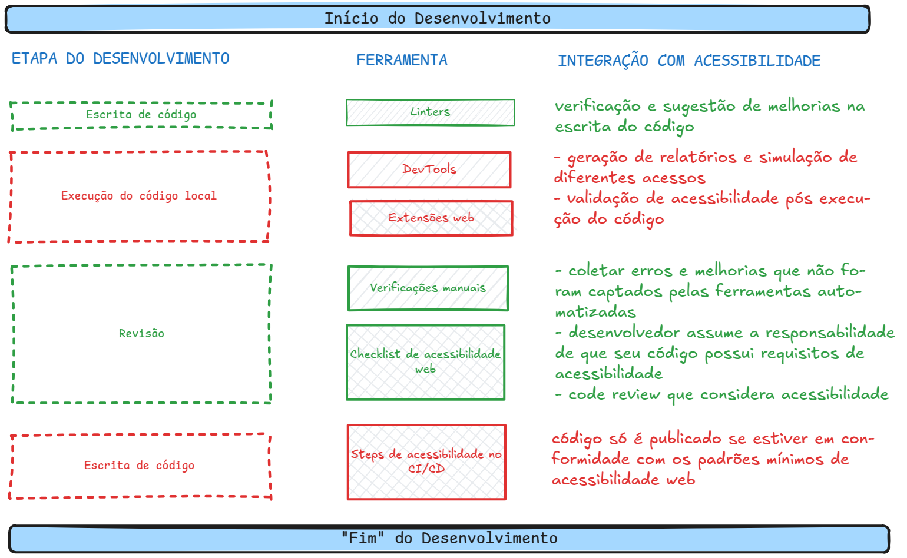

# Guia de Integração de Acessibilidade Web para Equipes de Desenvolvimento

👋 Olá! Seja muito bem-vindo(a)!

## Introdução 📖

Este documento apresenta a documentação do Guia de Integração de Acessibilidade Web para Equipes de Desenvolvimento. O objetivo central é demonstrar como a acessibilidade pode ser integrada de forma eficaz em todas as etapas do desenvolvimento de aplicações web, desde a concepção do código até a sua publicação.  

Desenvolvido na Universidade Federal de Alagoas como parte do TCC de uma estudante de Ciência da Computação, o Guia foi idealizado para ser simples, empregar ferramentas gratuitas e ser facilmente implementável por desenvolvedores de todos os níveis, desde juniores a seniores, bem como por aqueles que estão iniciando sua jornada no desenvolvimento web.

## Qual é a meta principal do Guia? 🤔

> 💡 Busca-se que a acessibilidade se torne um componente natural do ciclo de vida do software, através da utilização de ferramentas já familiares ao desenvolvedores web.

Além do princípio fundamental acima, os objetivos e princípios deste Guia são:

1. Ser **simples**
2. Utilizar como base ferramentas que já são comuns no dia a dia dos desenvolvedores
3. Ser **adaptável** a linguagens e/ou frameworks web
4. Ser **gratuito**, **acessível** ao público e à comunidade tech
5. Poder ser utilizado por equipes ou projetos pessoais
6. Ser **compreensível** para interessados em desenvolvimento web, desenvolvedores juniores e seniores
7. Diminuir problemas de acessibilidade pós-produção ou pós-publicação de projetos web
8. **NÃO** substituir testes com usuários e/ou avaliações com especialistas
9. Focar em problemas de acessibilidade mais simples e facilmente detectados por ferramentas automatizadas, a fim de abrir espaço para análises mais complexas sobre acessibilidade
10. Ser **melhorado continuamente** através de feedbacks e ajuda da comunidade
11. Ter como base os princípios **WCAG** (Web Content Accessibility Guidelines)

## Em quais etapas do desenvolvimento o Guia concentra sua atuação? 🎯

Este Guia foi projetado para facilitar a integração da acessibilidade em cada fase crucial do ciclo de desenvolvimento:

- ✍️ **Escrita de código**: Uso de **Linters** para auxiliar na criação de um código acessível desde o início.
- ⚙️ **Execução do código local**: Utilização de **extensões web**, **DevTools** e **verificações manuais** para avaliar a acessibilidade no ambiente de desenvolvimento.
- ✅ **Revisão**: Adoção de um **checklist de acessibilidade web** específico para Pull Requests com o intuito de assegurar que a acessibilidade seja devidamente revisada antes de cada atualização.
- 🚀 **Publicação**: Integração de **steps de acessibilidade ao processo de CI/CD** (Integração Contínua e Entrega Contínua), visando garantir que as aplicações já sejam concebidas com acessibilidade.

<!-- TODO: revisar essa imagem -->

## Estrutura da Documentação 🗺️

A documentação está organizada nos seguintes tópicos principais:

- 📖 [1.0. Introdução](./1.0.Introducao): Tópico atual
- 💡 [2.0. Motivação](./2.0.Motivacao.md): Será apresentada a história por trás da concepção deste Guia, abordando as inspirações provenientes da análise de sites educacionais e os desafios que motivaram o desenvolvimento desta proposta. O objetivo é fornecer o contexto e destacar a relevância da acessibilidade web no panorama atual.
- 🛠️ [3.0. Proposta](./3.0.Proposta.md): Este é o núcleo da documentação. Será detalhado o passo a passo para a implementação do Guia nos projetos. Cada etapa do ciclo de desenvolvimento será acompanhada por um guia prático e de fácil aplicação.
- 🗣️ [4.0. Espaço Feedback](./4.0.Espaco_Feedback.md): O feedback da comunidade é altamente valorizado. Este espaço é destinado à manifestação de críticas, sugestões e opiniões sobre o Guia. A participação dos usuários é essencial para o aprimoramento contínuo desta proposta.
- 👩‍💻 [5.0. Quem somos?](./5.0.Quem_somos.md): Será apresentada a equipe responsável por esta iniciativa, identificando os membros e fornecendo informações de contato.

 