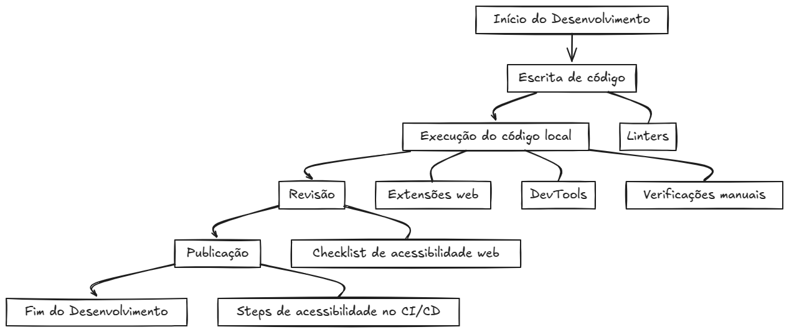

# Guia de Integração de Acessibilidade Web para Equipes de Desenvolvimento

👋 Olá! Seja muito bem-vindo(a)!

## Introdução 📖

Este documento apresenta a documentação de um Guia voltado para Acessibilidade Web. O objetivo central é demonstrar como a acessibilidade pode ser integrada de forma eficaz em todas as etapas do desenvolvimento de aplicações web, desde a concepção do código até a sua publicação.  

Desenvolvido na Universidade Federal de Alagoas como parte do TCC de uma estudante de Ciência da Computação, o Guia foi idealizado para ser simples, empregar ferramentas gratuitas e ser facilmente implementável por desenvolvedores de todos os níveis, desde juniores a seniores, bem como por aqueles que estão iniciando sua jornada no desenvolvimento web.

## Qual é a meta principal do Guia? 🤔

O propósito fundamental é que a acessibilidade deixe de ser uma consideração tardia nos projetos web.

> 💡 Busca-se que a acessibilidade se torne um componente natural do ciclo de vida do software, através da utilização de ferramentas já familiares às equipes de desenvolvimento.

Para que, dessa forma, a acessibilidade passe a ser um elemento essencial em cada fase do processo, e não apenas um "extra".

## Em quais etapas do desenvolvimento o Guia concentra sua atuação? 🎯

Este Guia foi projetado para facilitar a integração da acessibilidade em cada fase crucial do ciclo de desenvolvimento:

- ✍️ **Escrita de código**: Uso de **Linters** para auxiliar na criação de um código acessível desde o início.
- ⚙️ **Execução do código local**: Utilização de **extensões web**, **DevTools** e **verificações manuais** para avaliar a acessibilidade no ambiente de desenvolvimento.
- ✅ **Revisão**: Adoção de um **checklist de acessibilidade web** específico para Pull Requests com o intuito de assegurar que a acessibilidade seja devidamente revisada antes de cada atualização.
- 🚀 **Publicação**: Integração de **steps de acessibilidade ao processo de CI/CD** (Integração Contínua e Entrega Contínua), visando garantir que as aplicações já sejam concebidas com acessibilidade.

## Estrutura da Documentação 🗺️

A documentação está organizada nos seguintes tópicos principais:

- 📖 **Introdução**: Tópico anterior
- 💡 **Motivação**: Será apresentada a história por trás da concepção deste Guia, abordando as inspirações provenientes da análise de sites educacionais e os desafios que motivaram o desenvolvimento desta proposta. O objetivo é fornecer o contexto e destacar a relevância da acessibilidade web no panorama atual.
- 🛠️ **Proposta**: Este é o núcleo da documentação. Será detalhado o passo a passo para a implementação do Guia nos projetos. Cada etapa do ciclo de desenvolvimento será acompanhada por um guia prático e de fácil aplicação.
- 🗣️ **Espaço Feedback**: O feedback do público é altamente valorizado. Este espaço é destinado à manifestação de críticas, sugestões e opiniões sobre o Guia. A participação dos usuários é essencial para o aprimoramento contínuo desta proposta.
- 👩‍💻 **Quem somos?**: Será apresentada a equipe responsável por esta iniciativa, identificando os membros e fornecendo informações de contato.

Dentro da seção **"🛠️ Proposta"**, cada step do Guia seguirá esta estrutura:

Para otimizar o aprendizado e a aplicação do Guia, cada etapa da proposta seguirá uma estrutura consistente e didática:

- 🧰 **Ferramenta**: Será apresentada a ferramenta relevante para cada etapa do Guia. Uma explicação clara sobre a ferramenta será fornecida, abordando seu funcionamento no contexto real e ilustrando com exemplos de uso prático. Mesmo para aqueles sem experiência prévia, uma base sólida será estabelecida.

> ⚠️ **Atenção**: Para usuários já familiarizados com a ferramenta, a seção sobre acessibilidade web pode ser consultada diretamente.

- 🌐 **Acessibilidade web através dessa ferramenta**: Este é o ponto central. Será demonstrado como a ferramenta pode ser aplicada no contexto da acessibilidade web. Tutoriais, exemplos práticos e materiais de apoio serão disponibilizados para facilitar a implementação eficaz da acessibilidade nos projetos.
- 🏆 **Benefícios e Pontos de Melhoria ou Atenção**: Serão destacados os benefícios da utilização da ferramenta para acessibilidade web, bem como os pontos que demandam maior atenção ou que podem ser aprimorados. Dessa forma, uma perspectiva abrangente sobre os aspectos positivos e áreas de atenção de cada abordagem será oferecida.

Espera-se que esta documentação sirva como um guia valioso e inspirador para a comunidade de desenvolvimento web. **Juntos, é possível construir uma web mais acessível e inclusiva para todos. 💙**
 