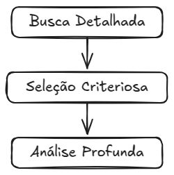

# Motivação: a história por trás deste Guia

Você já se perguntou como está a acessibilidade web nos ambientes de educação online? Essa foi a pergunta de partida para uma **Revisão Sistemática (RS)** detalhada, que deu origem a este Guia.

## Mas, o que é exatamente uma Revisão Sistemática? 🕵️‍♀️

Imagine que você é um detetive em busca de pistas sobre um tema. Uma **Revisão Sistemática (RS)** é como uma investigação profunda, onde se busca, analisa e reúne as melhores "evidências" científicas já publicadas sobre um assunto. No nosso caso, o foco foi entender como anda a acessibilidade web nas plataformas online em contexto educacional.

## Como foi feita essa investigação? 🔎

Para desvendar esse mistério, a RS seguiu alguns passos importantes:

*   **Busca Detalhada:** Foram vasculhadas diversas bases de dados científicas em busca de estudos que avaliaram a acessibilidade de ambientes educacionais online.
*   **Seleção Criteriosa:** Dos muitos estudos encontrados, apenas os mais relevantes e com métodos rigorosos foram selecionados para análise. 🪅
*   **Análise Profunda:** Cada estudo selecionado foi analisado minuciosamente para identificar os principais problemas de acessibilidade encontrados e entender o que as pesquisas já diziam sobre o tema. 🤓

## E o que essa investigação revelou? 🚨

Os resultados da Revisão Sistemática foram **alarmantes** 😲:

*   **Muitos erros de acessibilidade:** A grande maioria dos estudos apontou resultados **insatisfatórios** em termos de acessibilidade nos ambientes educacionais online.
*   **Falta de "texto alternativo" nas imagens:** O erro **mais comum**, presente em mais de 90% dos estudos, foi a ausência de alternativas textuais para imagens, links e vídeos.
*   **Diretrizes WCAG muito violadas:** As diretrizes da **WCAG (Web Content Accessibility Guidelines)**, que são como as "regras de ouro" da acessibilidade web, foram frequentemente descumpridas. Principalmente aquelas do princípio "**Perceptível**", que garante que o conteúdo seja apresentado de forma que todos possam perceber.
*   **Problemas graves de usabilidade:** Um dos estudos com feedback de usuários reais mostrou que estudantes não conseguiam acessar recursos essenciais de sites de universidades devido a erros de acessibilidade.

## Causas dos Problemas 🤯

A investigação também buscou entender o porquê de tantos erros de acessibilidade. As causas apontadas foram:

*   **Falta de experiência dos desenvolvedores:** Muitos desenvolvedores podem não ter o conhecimento necessário sobre acessibilidade web. 🧑‍💻
*   **Desconhecimento de leis e padrões:** Falta de informação sobre as leis e diretrizes de acessibilidade por parte de quem desenvolve e gere os ambientes online. ⚖️
*   **Falta de testes manuais:** Muitas avaliações se baseiam apenas em ferramentas automáticas, e esquecem de testes feitos por pessoas reais, que podem identificar problemas que as ferramentas não pegam. 🧑‍🦯
*   **Falta de profissionais especializados:** Poucos profissionais com expertise em acessibilidade web. 👩‍🎓

## Impacto na Educação 💔

A Revisão Sistemática revelou uma falta de estudos sobre o impacto direto da inacessibilidade na experiência educacional dos usuários. Ou seja, ainda não se sabe totalmente como esses problemas afetam o aprendizado e a vida dos estudantes. Mas, um estudo mostrou que erros de acessibilidade **impediram estudantes de acessar informações e realizar atividades essenciais** em plataformas online.

## Conectando os pontos: Da Investigação à Proposta 🔗

Diante desse cenário **preocupante**, surgiu a motivação para criar este Guia! 🚀 Se a acessibilidade web em ambientes educacionais online está tão **precária** e os erros são **recorrentes e impactantes**, é preciso agir! 💪

O Guia surge como uma proposta para **integrar a acessibilidade de forma mais simples e eficiente** no dia a dia do desenvolvimento web. 🛠️ A ideia é fornecer um **guia prático** para que desenvolvedores, de todos os níveis, consigam incorporar a acessibilidade em cada etapa de seus projetos, desde a escrita do código até a publicação e manutenção. O legal desta ideia é que ela consegue ir além do contexto educacional e ser **aplicável em qualquer time de desenvolvimento de software voltado para web**.

### 👀 Ficou curioso sobre o estudo?

_Na sessão **“Quem somos?”** vão ter alguns contatos e você pode entrar em contato com eles para ter informações sobre o estudo. Por enquanto o TCC ainda **não** foi finalizado, mas quando for publicado, ele será disponibilizado aqui gratuitamente._