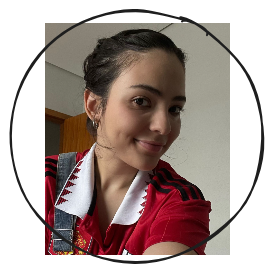
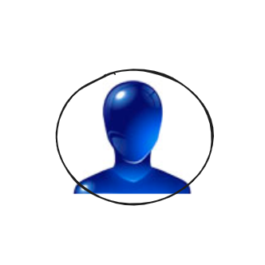

# Quem somos?

## Eirene Fireman

Olá! 👋 Eu sou Eirene Fireman, desenvolvedora web com pouco mais de 3 anos de experiência. Ao longo desses anos, pude trabalhar em times multidisciplinares como desenvolvedora fullstack. Atualmente, estou finalizando minha graduação em Ciência da Computação pela Universidade Federal de Alagoas (UFAL) e também sou dev no Luizalabs.

A motivação para criar este Framework surgiu durante a realização do meu Trabalho de Conclusão de Curso (TCC), onde, junto com meu orientador, investigamos a fundo a realidade da acessibilidade web em ambientes educacionais online. Os resultados alarmantes dessa pesquisa me impulsionaram a buscar soluções práticas e integradas para tornar a acessibilidade uma parte natural e contínua do processo de desenvolvimento web.

Espero que este Framework possa contribuir para que cada vez mais desenvolvedores construam aplicações web mais inclusivas e acessíveis para todos!

*   [LinkedIn](https://www.linkedin.com/in/eirenefireman/)
*   [Email](eireneof@gmail.com)
*   [Github](https://github.com/eireneof)

## Fábio José da Silva Coutinho

Fábio José da Silva Coutinho, é orientador deste projeto e professor da Universidade Federal de Alagoas (UFAL). Possui Doutorado em Engenharia de Sistemas de Computação pela UFRJ. Hoje em dia, na UFAL, ele se dedica ao ensino e pesquisa nas áreas de Banco de Dados, Computação Distribuída, Computação de Alto Desempenho, Sistemas de Informação e Linguagens de Programação.

*   [Currículo Lattes](http://lattes.cnpq.br/6352083877939941)