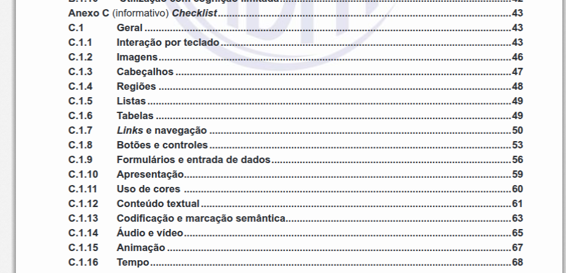
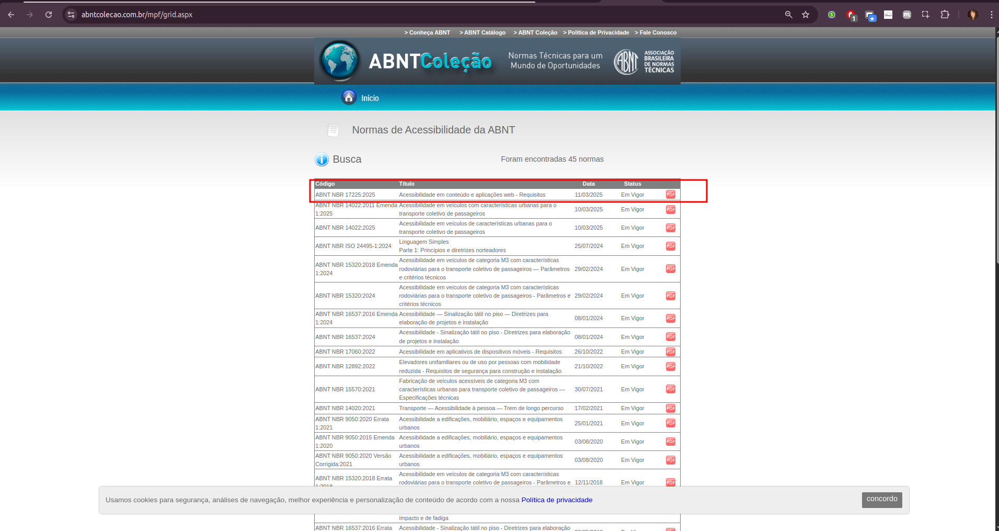
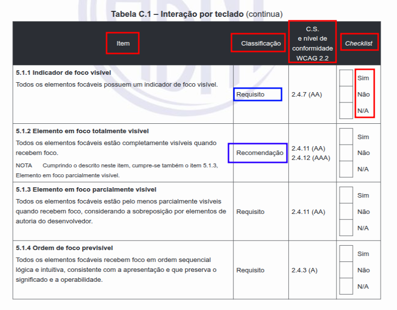

# Tutorial: Validando seu Código com a ABNT NBR 17225 🛠️

Vamos explorar como usar uma ferramenta super útil que a norma oferece: o **checklist**. Ele vai te ajudar a verificar se o seu código e o seu site estão no caminho certo para serem acessíveis. 🌐

Você encontra esse checklist no **Anexo C** da norma ABNT NBR 17225. Ele organiza os pontos de acessibilidade de forma prática, seguindo os mesmos temas da norma (como teclado, imagens, formulários, etc.).

## Pré-requisitos ✅

Para aproveitar melhor este tutorial, é importante:

1. **Compreender a relevância da acessibilidade e o papel desempenhado pela norma ABNT NBR 17225**.  
    - Caso precise de mais informações, consulte a seguinte documentação: [Cumprindo Conformidades Legais de Acessibilidade Web](../../docs/3.5.Conformidades_legais.md). Este tutorial foi feito com base nela.

2. **Estar com o documento da norma aberto.**  
    - Você pode consultá-lo diretamente no site da ABNT: [Normas de Acessibilidade da ABNT](https://www.abntcolecao.com.br/mpf/default.aspx?T=9BC37A821F0D).

> **Nota:** O link para o site da ABNT Coleções pode falhar ocasionalmente. Caso isso aconteça, você pode buscar pela norma diretamente no Google, utilizando o termo "ABNT NBR 17225 site:abntcolecao.com.br", para encontrá-la na página oficial de coleções da ABNT.

## Como o Checklist Funciona? 📝

O checklist é como uma lista de perguntas que você vai responder sobre o seu site. Ele possui algumas colunas para cada item a ser verificado:

1. **Item:** É o número e o nome do ponto específico da norma que você está avaliando (por exemplo, "5.1.1 Indicador de foco visível").
2. **Classificação:** Aqui ele indica se aquele item é um **Requisito** ou uma **Recomendação**:
    - **Requisito:** Algo **obrigatório** para o seu site ser considerado acessível nos níveis mais comuns (Níveis A e AA do padrão internacional WCAG 2.2). O Nível AA é geralmente o mínimo esperado.
    - **Recomendação:** São **boas práticas** que tornam a experiência ainda melhor (ligadas ao Nível AAA do WCAG). É ótimo seguir as recomendações sempre que possível.
3. **C.S. e nível de conformidade WCAG 2.2:** Mostra qual o ponto correspondente no padrão internacional WCAG e o nível (A, AA ou AAA) que ele cobre. É uma referência técnica.
4. **Checklist (Sim, Não, N/A):** É onde você vai marcar o resultado da sua verificação:
    - **✅ Sim:** Marque aqui se o seu código/site **atende** ao que o item pede.  
    - **❌ Não:** Marque aqui se o seu código/site **não atende** ao que o item pede. Não se preocupe, é para isso que estamos verificando: encontrar o que precisa ser ajustado. 🔧  
    - **➖ N/A (Não Se Aplica):** Marque aqui se aquele item **não faz sentido** para a parte do site que você está avaliando. Por exemplo, se a página não tem nenhum vídeo, você pode marcar "N/A" nos itens sobre acessibilidade de vídeo.

Resumo dos Itens do Checklist: 

- **Total de itens no checklist:** 130
- **Itens recomendáveis:** 51
- **Itens mandatórios (Requisitos):** 79

Pode parecer que são muitos itens, e realmente são! Mas não se preocupe com a quantidade. **O objetivo não é resolver tudo de uma vez**, especialmente em sites maiores, mais antigos ou se você estiver trabalhando sozinho. A melhor abordagem é encontrar um método que funcione para você e/ou para o seu time. Incorpore essa verificação no seu fluxo de trabalho diário ou no processo do seu time, e avance gradualmente. **O mais importante é começar e transformar essa validação em uma prática contínua.** 🚀

## Seu Passo a Passo para a Validação 🛤️

Validar com o checklist é um processo sistemático. Siga estes passos:

1. **Entenda o Objetivo:** Lembre-se que o objetivo é verificar se o seu site atende aos pontos da norma, principalmente os **Requisitos** (que são obrigatórios) e, se possível, as **Recomendações** (para um site ainda mais acessível).
2. **Pegue o Checklist:** Abra o checklist (Anexo C da ABNT NBR 17225). Você pode imprimir ou usar uma versão digital.
3. **Vá Item por Item:** Comece pelo primeiro item e vá descendo na lista, um por um.
4. **Olhe para o seu Código e para o Site:** Para cada item do checklist, analise como aquela parte está implementada no seu código e veja como ela se comporta no navegador. Por exemplo:
    - O item fala sobre texto alternativo em imagens? Vá no seu HTML e veja se as tags `` têm o atributo `alt` correto.
    - O item fala sobre navegação por teclado? Tente usar apenas o teclado no seu site e veja se você consegue acessar todos os elementos interativos e se o indicador de foco aparece.
    - O item fala sobre contraste de cores? Use uma ferramenta de análise de contraste para verificar as cores do texto e do fundo.
5. **Marque no Checklist:** Depois de verificar, marque "Sim", "Não" ou "N/A" na coluna do checklist para aquele item.
6. **Corrija os "Não":** Para todos os itens que você marcou como "Não", especialmente os **Requisitos**, volte no seu código e faça as alterações necessárias para que eles atendam à norma. Para as Recomendações marcadas como "Não", analise se é possível e vale a pena implementar a melhoria.
7. **Considere as Dicas Extras da Norma:** A norma traz outros anexos e seções que podem te ajudar muito:
    - O **Anexo B (Desempenho Funcional)** explica como diferentes tipos de deficiência impactam a navegação, te ajudando a entender *por que* certos requisitos são importantes.
    - O **Anexo A (Itens Problemáticos para Acessibilidade)** lista coisas comuns na web que costumam dar problema de acessibilidade (como alguns tipos de pop-ups ou carrosséis) e que precisam de atenção redobrada.
    - O **Material de Apoio (Seção 6)** pode indicar ferramentas e recursos úteis.

## Considerações Finais

🎉 **Parabéns por ter chegado até o fim deste tutorial!** 🎉

Ao usar o checklist da ABNT NBR 17225 de forma cuidadosa, você está realizando uma validação técnica importante que para garantir que o seu trabalho está caminhando para conformidade com as leis e normas de acessibilidade do Brasil.

Caso este tutorial tenha te ajudado de alguma forma, **nos ajude a melhorar este projeto respondendo ao nosso [formulário de feedback](https://forms.gle/U75FJSutNxZ2bwWG7). 😄**
