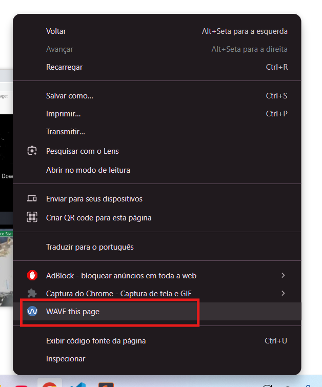
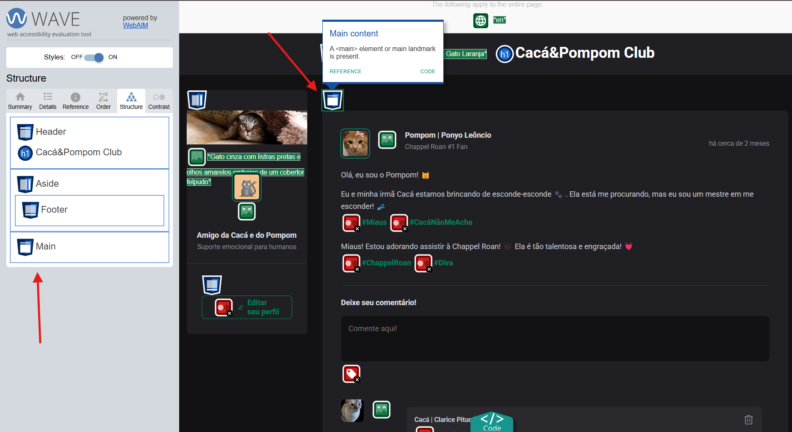
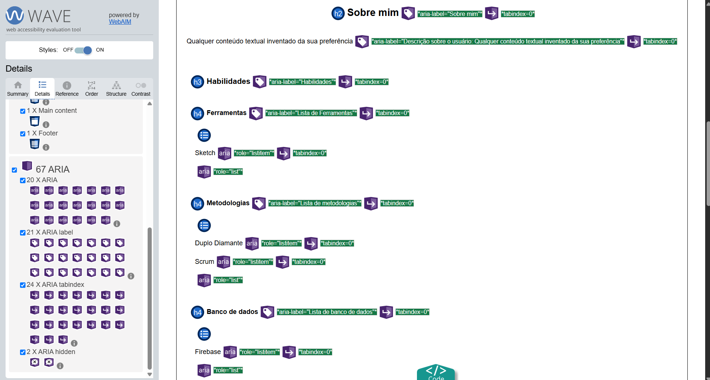

Com certeza! Abaixo está o texto ajustado e com a seção "O que é o WAVE?" expandida:

# Tutorial: Usando a extensão WAVE para identificar problemas de acessibilidade 🌊

Este tutorial foi elaborado utilizando as seguintes configurações:
- **Navegador:** Chrome

A utilização do WAVE é relativamente simples, e este tutorial foi baseado na [documentação oficial disponível na página da extensão na Chrome Web Store](https://chromewebstore.google.com/detail/wave-evaluation-tool/jbbplnpkjmmeebjpijfedlgcdilocofh?hl=pt-PT&utm_source=ext_sidebar).

## O que é o WAVE?

O [WAVE](https://wave.webaim.org/extension/) (Web Accessibility Evaluation Tool) é uma extensão gratuita para navegadores desenvolvida pela [WebAIM (Web Accessibility In Mind)](https://webaim.org/). Sua principal função é auxiliar desenvolvedores, designers, criadores de conteúdo e qualquer pessoa interessada em tornar a web mais acessível.

O WAVE não apenas aponta os problemas, mas também fornece informações detalhadas sobre cada um deles, incluindo links para a documentação do [WCAG (Web Content Accessibility Guidelines)](https://www.w3.org/WAI/standards-guidelines/wcag/), o padrão internacional de acessibilidade na web. Isso permite que os usuários entendam a importância de cada correção e aprendam a implementar soluções eficazes.

## Instalação

###  1.  **Instale a extensão**

Procure por "WAVE Evaluation Tool" na loja de extensões do seu navegador e instale.

O WAVE possui suporte para os seguintes navegadores: Chrome, Firefox e Microsoft Edge

- [Extensão WAVE para Chrome](https://chrome.google.com/webstore/detail/wave-evaluation-tool/jbbplnpkjmmeebjpijfedlgcdilocofh)
- [Extensão WAVE para Firefox](https://addons.mozilla.org/en-US/firefox/addon/wave-accessibility-tool/) 
- [Extensão WAVE para Microsoft Edge](https://microsoftedge.microsoft.com/addons/detail/wave-evaluation-tool/khapceneeednkiopkkbgkibbdoajpkoj) 

## Auditando uma página web com o WAVE

### 2.  **Abra a página web que você quer testar**

Navegue até a página que você deseja verificar a acessibilidade. Pode ser uma página local ou na web.

### 3. **Acesse o WAVE**
- Clique com o botão direito do seu mouse
- Encontre a opção referente ao WAVE. Geralmente "Wave this page" e clique nela.

**Vistoria feita!** 🔍  

Viu como é fácil?  

## Entendendo Resultados 📊

O Wave insere na sua página um menu lateral com diversas funcionalidades para te ajudar a identificar e corrigir problemas de acessibilidade no seu código. Vamos entender cada uma delas de forma simples:
| Item do menu | O que é? | Para que serve? |
|---|---|---|
| **Summary (Resumo)** | Panorama geral da acessibilidade da página, mostrando quantos erros, alertas, recursos, elementos estruturais e problemas de contraste foram detectados. | É o primeiro lugar para olhar. Ele te ajuda a priorizar o que precisa ser corrigido. |
| **Details (Detalhes)** | Listas completas de todos os problemas daquele tipo encontrados na página. | Diz exatamente onde o problema está no seu código e qual é o problema. |
| **Reference (Referência)** | Explicação detalhada sobre aquele problema específico de acessibilidade segundo a WCAG. | O "Reference" te ajuda a entender por que aquele item é um problema de acessibilidade e como você pode corrigi-lo. |
| **Order (Ordem)** | Visualização da ordem em que os elementos da página recebem foco quando um usuário navega usando apenas o teclado. | Para garantir que a ordem de foco faça sentido visualmente e logicamente. |
 **Structure (Estrutura)** | Uma seção que destaca a estrutura semântica da sua página, mostrando elementos como cabeçalhos `(<h1>, <h2>, etc.)`, landmarks `(<nav>, <main>, <footer>)`, e listas `(<ul>, <ol>)`. | Ajuda a criar um "mapa" visual da sua página. |
| **Contrast (Contraste)** | Análise do contraste de cores entre o texto e o fundo da página. | Mostra onde o contraste não atende aos padrões de acessibilidade. |

Além do menu, ao analisar uma página, o WAVE injeta ícones e indicadores diretamente no conteúdo, revelando informações importantes sobre a acessibilidade do site. Ele identifica uma ampla gama de problemas e recursos de acessibilidade, categorizando-os em:
* **Erros 🔴:** Problemas que impedem ou dificultam o acesso de pessoas com deficiência ao conteúdo.  Indicam violações das WCAG que **precisam** ser corrigidas.
* **Alertas ⚠️:** Potenciais problemas que exigem revisão manual para determinar seu impacto na acessibilidade.  
* **Recursos ✅:** Elementos que contribuem para a acessibilidade da página (ex: landmarks HTML5, ARIA roles).
* **Elementos Estruturais 🏗️:** Informações sobre a estrutura semântica da página (como headings e landmarks).  
* **Contraste 🎨:** Análise do contraste de cores para garantir a legibilidade do texto.

### Exemplos

**Identificação de elementos:**  

**Erros de contraste:**  

**Identificação de recursos de acessibilidade (ARIA):**  

## Próximos passos

🎉 **Parabéns por explorar o poder da extensão WAVE!** 🎉 Espero que este tutorial tenha te dado uma base sólida para começar a identificar e corrigir problemas de acessibilidade em suas páginas web.

> 💡 Lembre-se que a acessibilidade é uma jornada contínua. Utilize o WAVE como seu aliado nessa busca por uma web mais inclusiva. Ao corrigir os erros e prestar atenção aos alertas, você estará proporcionando uma experiência online melhor para todos os usuários, incluindo aqueles com deficiência.

Caso este tutorial tenha te ajudado de alguma forma, **nos ajude a melhorar este projeto respondendo nosso [formulário de feedback](https://forms.gle/U75FJSutNxZ2bwWG7). 😄**

