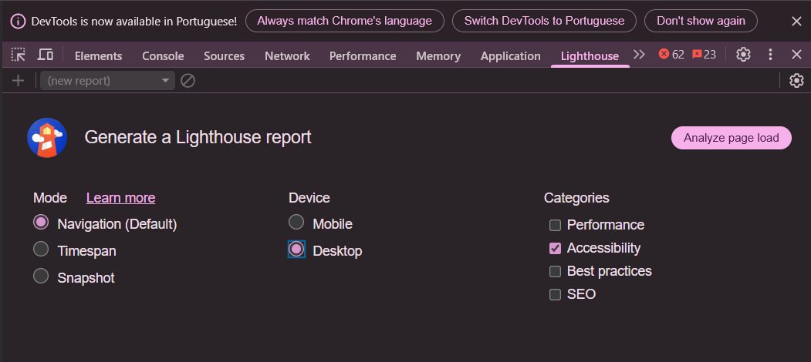
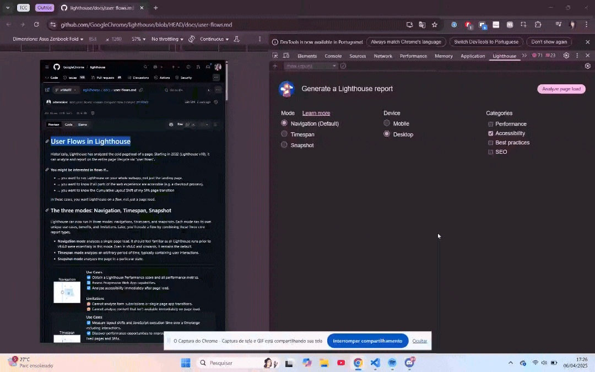
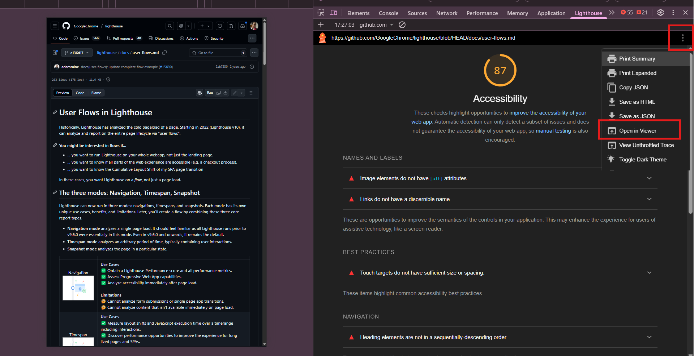
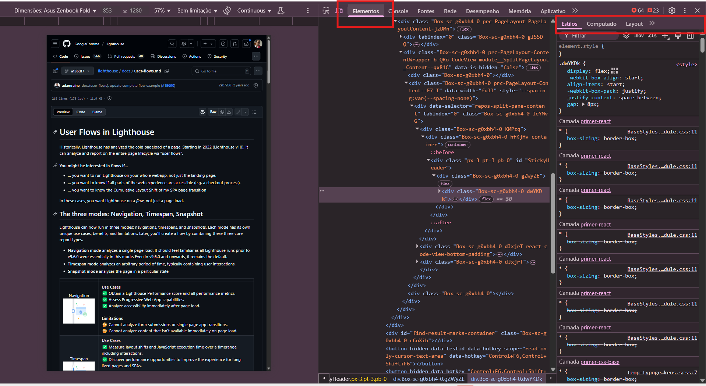
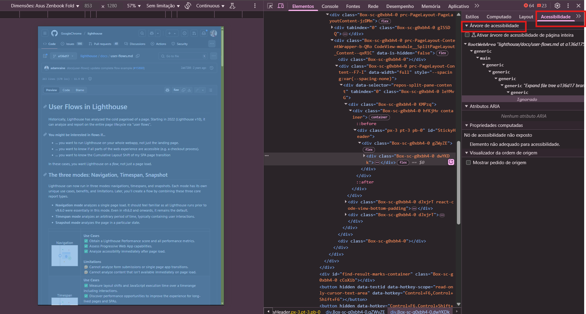
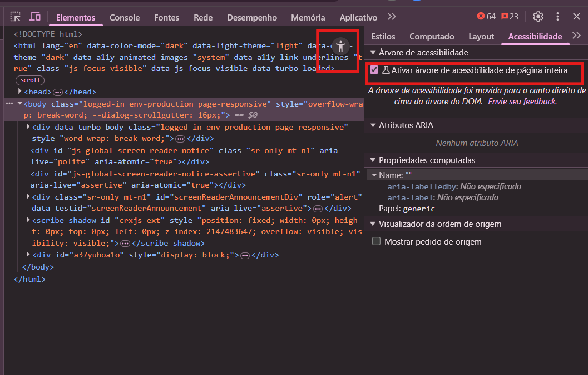
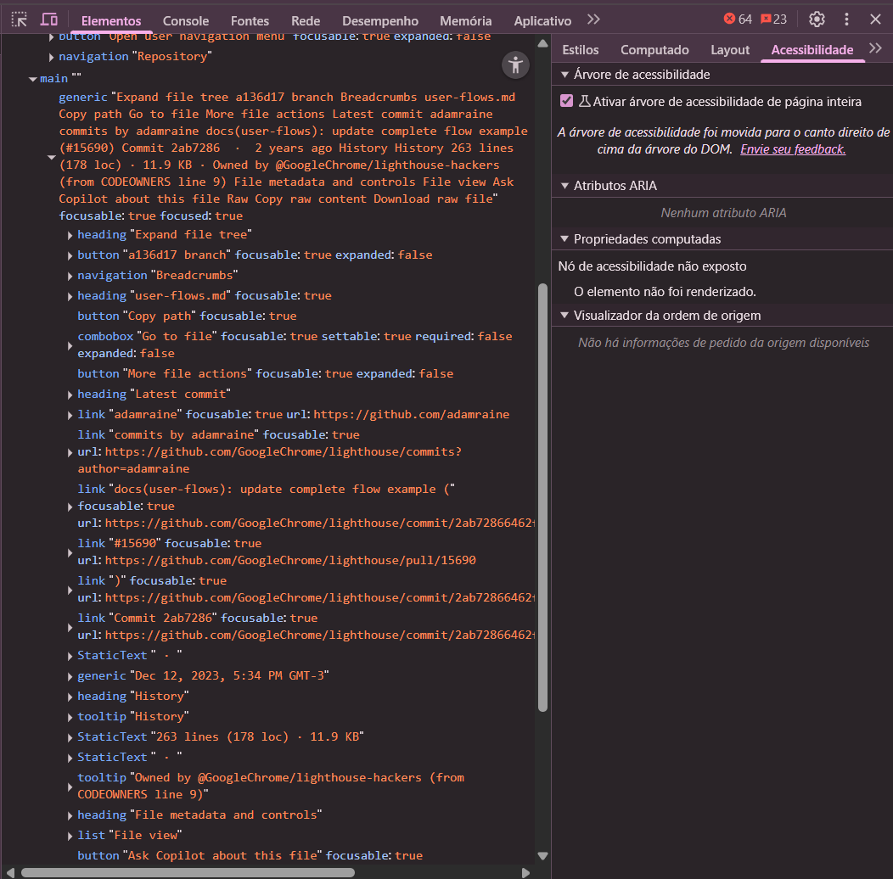
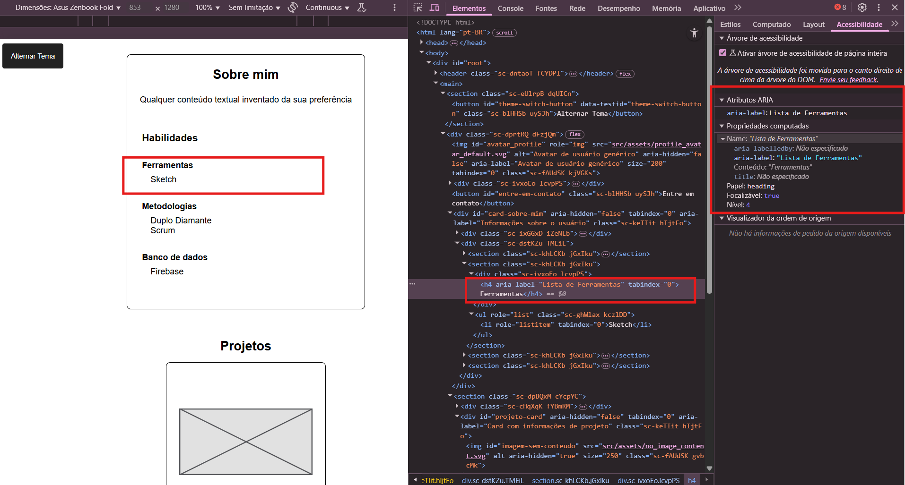
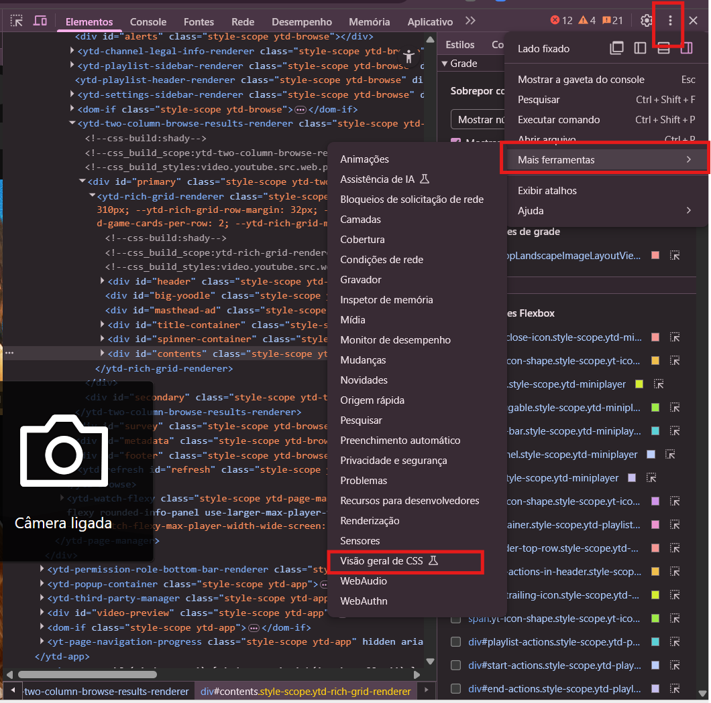
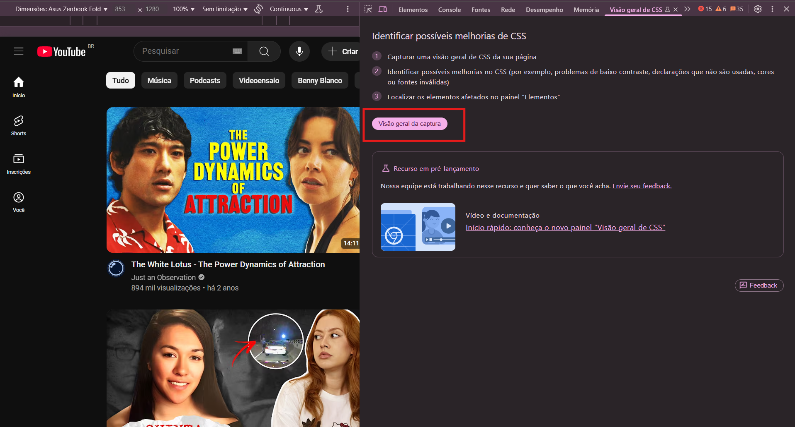

# Tutorial: Como utilizar os DevTools do Chrome como uma ferramenta de verificação de acessibilidade 🏆

Este tutorial foi feito utilizando as seguintes configurações:
- 🌐 **Navegador:** Chrome

## 🚀 O que é o Lighthouse?

O **Lighthouse** é uma ferramenta automatizada integrada ao DevTools do Chrome, projetada para ajudar desenvolvedores a melhorar a qualidade de suas páginas web. Ele realiza auditorias em diversas áreas, como **acessibilidade**, **performance**, **SEO** e **melhores práticas**, gerando relatórios detalhados com sugestões de melhorias. Por ser parte do DevTools, o Lighthouse é fácil de acessar e pode ser usado em qualquer página renderizada no navegador, tornando-se uma solução prática e poderosa para otimizar a experiência do usuário.

Neste tutorial, o foco será entender como utilizar o Lighthouse para avaliar e melhorar a **acessibilidade** de páginas web, garantindo que elas sejam inclusivas e acessíveis para diversos usuários. 🌟

## 📝 1. Gerar Relatórios de Acessibilidade

### **a) Abra o DevTools**  
Na página web que você quer testar, pressione **F12** ou clique com o botão direito e selecione **"Inspecionar"**.

### **b) Acesse a aba "Lighthouse"**  
No menu superior do DevTools, clique na aba **"Lighthouse"**.

### **c) Configure o relatório**  
Selecione as seguintes opções:  
- **Modo:** Navegação  
- **Dispositivo:** Desktop (ou Mobile, se preferir)  
- **Categoria:** Accessibility  

> **💡 Dica:** O modo **Navegação** é o padrão e mais comum. Ideal para avaliar a performance e a acessibilidade da carga inicial de uma página, como a página de destino de um site.  

Para saber mais sobre os outros modos, confira a documentação: [User Flows in Lighthouse](https://github.com/GoogleChrome/lighthouse/blob/HEAD/docs/user-flows.md).  

As **Categorias** disponíveis são:  
- **⚡ Performance:** Velocidade e capacidade de resposta da página.  
- **♿ Acessibilidade:** Facilidade de uso para diversos grupos de usuários (foco deste tutorial).  
- **🔒 Melhores Práticas:** Adesão a padrões modernos de desenvolvimento web (segurança, otimização, etc.).  
- **🔍 SEO:** Otimização para mecanismos de busca.  

### **d) Gere o relatório**  
Clique no botão **"Gerar relatório"**. O Lighthouse irá analisar a página e gerar um relatório completo em alguns segundos.  

### **e) Analise os resultados**  
O relatório do Lighthouse irá mostrar uma pontuação de acessibilidade (de **0 a 100**) e detalhar:  
- **✅ Auditorias aprovadas:** Recursos acessíveis.  
- **❌ Auditorias reprovadas:** Problemas de acessibilidade a serem corrigidos.  

Clique em cada auditoria reprovada para ver mais detalhes sobre o problema e sugestões de como corrigi-lo.  

Com o relatório gerado, clique no menu de configurações (ícone de três pontinhos) para acessar opções adicionais, como abrir o relatório em uma nova aba ou salvá-lo em diferentes formatos, como **HTML** ou **JSON**.  

📂 **Exemplo de relatório do Lighthouse:**  
[Relatório de exemplo](../../assets/reports/github_lighthouse_docs%20_user_flows.html) ao auditar a página da documentação [User Flows in Lighthouse](https://github.com/GoogleChrome/lighthouse/blob/HEAD/docs/user-flows.md). Este relatório é um arquivo do tipo `.html`, então recomendo abri-lo em um navegador.  

> **✨ Dica:** Você pode explorar o relatório de exemplo ou auditar uma página qualquer. **Lembre-se que é possível utilizar o Lighthouse em qualquer página renderizada pelo Chrome, então o céu é o limite!** 🚀  

## 🌳 2. Analisar a Árvore de Acessibilidade

Caso você tenha dúvidas, vale a pena dar uma lida nessa documentação: [A árvore de acessibilidade](https://web.dev/articles/the-accessibility-tree?hl=pt-br).  

### **a) Abra o DevTools**  
Na página que você deseja analisar, pressione **F12** ou clique com o botão direito e selecione **"Inspecionar"**.  

### **b) Acesse a aba "Elementos"**  
No DevTools, clique na aba **"Elementos"**.  

### **c) Encontre a sub-aba "Acessibilidade"**  
Dentro da aba **"Elementos"**, localize o subconjunto de abas e clique na sub-aba **"Acessibilidade"**.  

### **d) Visualize a Árvore de Acessibilidade**  
Na seção **"Acessibilidade"**, localize a área chamada **"Árvore de Acessibilidade"**. Aqui, você poderá observar como os elementos da página são representados na árvore.  

> **💡 Dica:** Note a quantidade de elementos **"generic"** na árvore neste exemplo. Isso ilustra a importância de usar `
` e outros elementos genéricos com sabedoria, pois eles podem impactar negativamente a acessibilidade.  

### **e) Ative a Árvore de Acessibilidade Completa (opcional)**  
Se desejar visualizar todos os elementos da página na árvore, ative a opção **"Ativar árvore de acessibilidade de página inteira"** e recarregue o DevTools.  

### **f) Explore os elementos na árvore**  
Clique no ícone de acessibilidade para visualizar os elementos de acordo com a estrutura da árvore.  

Antes:  

Depois:  

A **Árvore de Acessibilidade** reflete como leitores de tela e navegação por teclado interpretam a página. Use essa ferramenta para criar uma navegação fluida e semântica em seus projetos.  

## 🔍 3. Inspecionar Atributos ARIA e Propriedades Computadas

Os atributos [**ARIA (Accessible Rich Internet Applications)**](https://developer.mozilla.org/pt-BR/docs/Web/Accessibility/ARIA) são usados para fornecer informações semânticas adicionais sobre elementos HTML para tecnologias assistivas, como leitores de tela. Inspecionar esses atributos é fundamental para garantir que seu conteúdo seja compreendido corretamente por todos os usuários.  

Já as **propriedades computadas** são valores derivados que refletem o estado atual de um elemento na página, como estilos aplicados, dimensões e visibilidade.  

### **a) Abra o DevTools**  
Se já não estiver aberto, siga os passos do item 2 (a).  

### **b) Acesse a aba "Elementos"**  
Se já não estiver selecionada, siga os passos do item 2 (b).  

### **c) Selecione o Elemento**  
No painel **"Elementos"**, selecione o elemento HTML que você deseja inspecionar. Este deve ser o elemento que você suspeita ou sabe que possui atributos ARIA.  

### **d) Vá para a Guia "Acessibilidade"**  
Siga os passos do item 2 (c) para acessar a guia **"Acessibilidade"**.  

### **e) Verifique a seção "Atributos ARIA" e "Propriedades Computadas"**  
Na guia **"Acessibilidade"**, logo abaixo da **"Árvore de acessibilidade"**, você encontrará as seções **"Atributos ARIA"** e **"Propriedades Computadas"**.  

### **f) Analise os Atributos ARIA e as Propriedades Computadas**  

- **Atributos ARIA:** Esta seção listará todos os atributos ARIA presentes no elemento selecionado, juntamente com seus respectivos valores.  
- **Propriedades Computadas:** Esta seção mostrará as propriedades de acessibilidade calculadas pelo navegador para o elemento. Isso inclui informações como o nome acessível do elemento, sua descrição, role (função), e estados (como se está selecionado ou expandido).  

> **🔎 O que observar:**  
> - **Presença de Atributos ARIA:** Eles são necessários? A semântica HTML nativa não seria suficiente?  
> - **Valores Corretos:** Os valores refletem o estado atual do elemento?  
> - **Uso Adequado:** ARIA está complementando a semântica nativa ou mascarando a falta dela?  
> - **Nome e Descrição Computados:** O nome e a descrição fazem sentido no contexto da página?  
> - **Role Computado:** O role reflete o comportamento e a finalidade do elemento?  
> - **Estados Computados:** Os estados refletem o estado atual do elemento na interface?  

Ao inspecionar tanto os atributos ARIA quanto as propriedades computadas, você pode obter uma visão completa de como um elemento é exposto para usuários de tecnologias assistivas. Isso permite avaliar se as informações necessárias estão sendo fornecidas de forma adequada e se há oportunidades para simplificar ou melhorar a acessibilidade do seu código. 🌟  

## 🎨 4. Encontrar Problemas de Contraste

 O Lighthouse já identifica problemas de contraste no relatório que geramos anteriormente, mas você pode inspecionar elementos específicos para obter mais detalhes. 

### **a) Abra o DevTools e selecione um elemento** 
Se já não estiver aberto o Devtools, siga os passos do item 2 (a). Após aberto, selecione o elemento que você deseja analisar (por exemplo, um texto). 

### **b) Acesse a aba "Visão geral de CSS"** 
Clique  no ícone de três pontinhos. Então: **Mais ferramentas > Visão geral do CSS**.

### **c) Clique no botão "Visão Geral da Captura"**  

### **d) Analise os resultados**  
Essa funcionalidade fornece uma visão geral dos estilos e fontes utilizados na página. No entanto, como o foco deste tutorial é acessibilidade, vamos nos concentrar na seção **"Cores"** para identificar problemas de contraste e garantir que as combinações de cores atendam aos critérios de acessibilidade. 

> **💡 Dica:** Explore as outras opções disponíveis para obter insights adicionais sobre o design da página.

### **e) Em "Cores" encontre "Problemas de Contraste"**  
A análise de contraste no CSS Overview verifica a legibilidade do texto segundo as WCAG. 
    - **AA** é o nível mínimo aceitável para a maioria dos usuários com deficiência visual moderada. 
    - **AAA** é um nível mais alto para usuários com deficiência visual severa.

O **ideal** é que seu site passe com **AAA**, mas é **aceitável** passar com **AA**. Não cumprir nenhum dos dois é um problema e deve ser corrigido. 

O DevTools é uma ferramenta extremamente robusta, oferecendo diversas maneiras de analisar questões de acessibilidade relacionadas a cores e contrastes que iriam bem além deste tutorial cujo o foco é ser mais generalista. 

> 💡 Para explorar ainda mais essas funcionalidades, confira a documentação oficial do Chrome Developers: [Contraste e Legibilidade - Deixe seu site mais legível](https://developer.chrome.com/docs/devtools/accessibility/contrast?hl=pt-br).

 ## 🔍 5. Acompanhando o Elemento em Foco no Chrome DevTools 

Muitas vezes quando queremos testar a navegação por teclado, ao navegar com a tecla `Tab`, o indicador de foco pode sumir, dificultando a identificação do elemento ativo. Porém o DevTools consegue nos ajudar com isto também.

 ### **a) Abra o DevTools** Siga os passos do item 2 (a). 

 ### **b) Acesse a aba "Console"** 

 ### **c) Clique em "Criar expressão em tempo real" (Ícone de Olho :eye:)

 ### d) Digite `document.activeElement` e dê enter

 ### **d) Observe os elementos em foco** 
 
Ao clicar nos elementos da sua página, ou navegar com eles por teclado, note que o elemento atual vai sendo destacado em tempo real.

Esse acompanhamento do elemento atual em foco é interessante para: 

- Garantir que a ordem em que os elementos recebem foco ao pressionar a tecla **Tab** segue um fluxo lógico e intuitivo dentro da página.  
- Validar se o elemento em foco será destacado visualmente (por meio do anel de foco).

Ao finalizar este tutorial, você terá adquirido o conhecimento fundamental para utilizar o Chrome DevTools como uma ferramenta poderosa na verificação da acessibilidade do seu site. Você será capaz de:
- Gerar relatórios detalhados
- Analisar a estrutura de acessibilidade
- Inspecionar atributos ARIA, 
- Verificar problemas de contraste de cores
- Acompanhar a navegação por teclado. 

Lembre-se que o DevTools oferece ainda muitas outras opções voltadas para o desenvolvimento com foco em acessibilidade. Para explorar todas as funcionalidades, a [documentação de Acessibilidade do Chrome for Developers](https://developer.chrome.com/docs/devtools/accessibility/reference?hl=pt-br)  em  é um recurso valioso e foi a base para a criação deste tutorial.

Caso este tutorial tenha te ajudado de alguma forma, **nos ajude a melhorar este projeto respondendo nosso [formulário de feedback](https://forms.gle/U75FJSutNxZ2bwWG7). 😄**