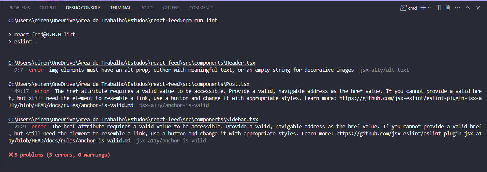
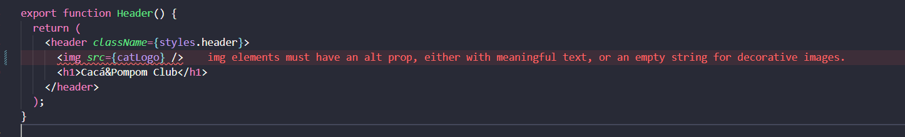
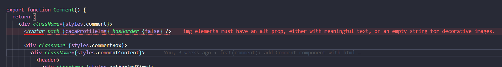

# Tutorial: Configurando o eslint-plugin-jsx-a11y no seu Projeto React

Este tutorial foi feito utilizando as seguintes configurações:
- ESLint versão 9.21.0 com arquivo de configuração flat config (eslint.config.js)
- React versão 19.0.0 com TypeScript versão 5.7.2
- eslint-plugin-jsx-a11y versão 6.10.2
- Editor de código: Visual Studio Code
- Extensão [Error Lens](https://marketplace.visualstudio.com/items?itemName=usernamehw.errorlens) não é obrigatória, apenas ajuda a visualizar melhor os erros do ESLint 

Os seguintes passos irão te guiar na configuração do plugin `eslint-plugin-jsx-a11y` em seu projeto React. Eles foram 100% baseados na [Documentação Oficial do eslint-plugin-jsx-a11y](https://www.npmjs.com/package/eslint-plugin-jsx-a11y). 

## O que é o eslint-plugin-jsx-a11y?

O `eslint-plugin-jsx-a11y` é um plugin para ESLint que realiza uma análise estática do seu código JSX para identificar problemas de acessibilidade em aplicações React.

**Importante:** Este plugin analisa apenas o código estático. A própria documentação dele recomenda, para uma análise completa, incluindo o DOM renderizado, usar ferramentas como o `@axe-core/react`, destacando a importância de também testar suas aplicações com tecnologias assistivas. Existem outras maneiras de configurar e personalizar esse plugin que podem ser vistas na própria documentação oficial dele. Neste tutorial, vamos seguir com um exemplo que acredito que se adapte bem a vários contextos e seja mais amplo.

## Instalação

Primeiro, certifique-se de que o ESLint já está instalado e **funcionando corretamente** no seu projeto. Caso tenha dúvidas, siga o passo a passo de instalação da própria [Documentação do ESLint](https://eslint.org/docs/latest/use/getting-started).

Em seguida, instale o `eslint-plugin-jsx-a11y`:

**a)** Caso você **não** tenha o ESLint instalado globalmente:

```bash
# npm
npm install eslint-plugin-jsx-a11y --save-dev
# ou
# yarn
yarn add eslint-plugin-jsx-a11y --dev
```

**b)** Caso você **tenha** o ESLint instalado globalmente:

```bash
# npm
npm install -g eslint-plugin-jsx-a11y
# ou
# yarn
yarn global add eslint-plugin-jsx-a11y
```

## Configuração no `eslint.config.js`

### 1. Importe o plugin

```typescript
import jsxA11y from "eslint-plugin-jsx-a11y";
```

### 2. Escolha entre as Configurações strict ou recommended

- **Conjunto de Regras:** Ambos os modos (`recommended` e `strict`) habilitam o mesmo conjunto de regras listadas na documentação.

- **Configurações e Severidade:** A diferença principal está provavelmente nas configurações padrão e nos níveis de severidade dessas regras. A documentação não deixa muito claro, mas o modo `strict` parece ser mais rigoroso na aplicação dessas regras.

**Extenda a configuração desejada:**

```typescript
import js from "@eslint/js";
import globals from "globals";
import reactHooks from "eslint-plugin-react-hooks";
import reactRefresh from "eslint-plugin-react-refresh";
import tseslint from "typescript-eslint";
import jsxA11y from "eslint-plugin-jsx-a11y";

export default tseslint.config(
    { ignores: ["dist"] },
    {
        files: ["**/*.{ts,tsx}"],
        extends: [
            js.configs.recommended, 
            ...tseslint.configs.recommended,
            jsxA11y.flatConfigs.strict, // Adicione aqui a configuração do jsx-a11y
        ],
        languageOptions: {
            ecmaVersion: 2020,
            globals: globals.browser,
            parserOptions: {
                ecmaFeatures: {
                    jsx: true,
                },
            },
        },
        plugins: {
            "react-hooks": reactHooks,
            "react-refresh": reactRefresh,
        },
        rules: {
            ...reactHooks.configs.recommended.rules,
            "react-refresh/only-export-components": [
                "warn",
                { allowConstantExport: true },
            ],
        },
    }
);
```

### 3. Rode o ESLint e observe se há erros

No meu caso, eu utilizo o `npm` e tenho esse script configurado no meu `package.json`: 

```bash
"lint": "eslint .",
```

Você deve rodar o comando que se adeque ao seu projeto e configurações.

Aqui você já consegue ver alguns erros apontados pelo plugin, caso eles existam.

No terminal:



No código:



### 4. Mapeamento de componentes

Você deve indicar para o plugin a que tags HTML seu componente se refere. Por exemplo, se você tem um componente `CustomButton` que renderiza um `button`, você pode configurá-lo para que as regras de acessibilidade para botões sejam aplicadas a ele.

Para isso, você precisa adicionar a seção settings dentro do objeto de configuração que se aplica aos seus arquivos React. Dentro de settings, você terá a chave jsx-a11y e, dentro dela, a chave components.

```typescript
export default tseslint.config(
    { ignores: ["dist"] },
    {
        files: ["**/*.{ts,tsx}"],
        extends: [
            js.configs.recommended, 
            ...tseslint.configs.recommended,
            jsxA11y.flatConfigs.strict,
        ],
        languageOptions: {
            ecmaVersion: 2020,
            globals: globals.browser,
            parserOptions: {
                ecmaFeatures: {
                    jsx: true,
                },
            },
        },
        plugins: {
            "react-hooks": reactHooks,
            "react-refresh": reactRefresh,
        },
        rules: {
            ...reactHooks.configs.recommended.rules,
            "react-refresh/only-export-components": [
                "warn",
                { allowConstantExport: true },
            ],
        },
        settings: { // Adicione a seção settings aqui
            "jsx-a11y": {
                "components": {
                    "Avatar": "img",
                    // Adicione outros mapeamentos conforme necessário

                    // Exemplo:
                    // "NomeDoSeuComponenteCustomizado": "elementoDOMCorrespondente",
                    // "MeuBotao": "button",
                    // "EntradaDeTexto": "input",
                },
            } 
        },
    }
);
```



## Informações Adicionais Importantes da Documentação:

* **Listagem de Regras Específicas:** A documentação fornece uma lista completa de todas as regras suportadas pelo plugin, juntamente com suas descrições e as configurações em que estão habilitadas (`recommended` e `strict`). Você pode consultar essa lista para habilitar regras específicas conforme a necessidade do seu projeto.

* **Configurações (`settings`):**
        * **`attributes`:** Permite configurar quais propriedades JSX correspondem a atributos HTML. Por exemplo, você pode querer que a propriedade `for` seja verificada além de `htmlFor` em elementos `<label>`.
        * **`polymorphicPropName`:** Permite definir o nome da prop que seu código usa para criar componentes polimórficos. Isso ajuda o plugin a determinar o tipo do elemento para aplicar as regras corretamente. Por exemplo, se você usa uma prop chamada `as` para definir o elemento (ex: `<Box as="h3">`), você pode configurar isso para que o plugin avalie o `<Box>` como um `h3`.

## Considerações Finais

🎉 **Parabéns por ter chegado até o fim deste tutorial!** 🎉

Ao seguir estes passos, você terá configurado com sucesso o `eslint-plugin-jsx-a11y` no seu projeto React utilizando `eslint.config.js`, garantindo que seu código JSX seja analisado em busca de problemas de acessibilidade. Consulte a documentação completa para explorar todas as configurações e regras disponíveis.

Caso este tutorial tenha te ajudado de alguma forma, **nos ajude a melhorar este projeto respondendo nosso [formulário de feedback](https://forms.gle/U75FJSutNxZ2bwWG7). 😄**
