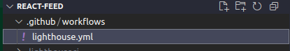
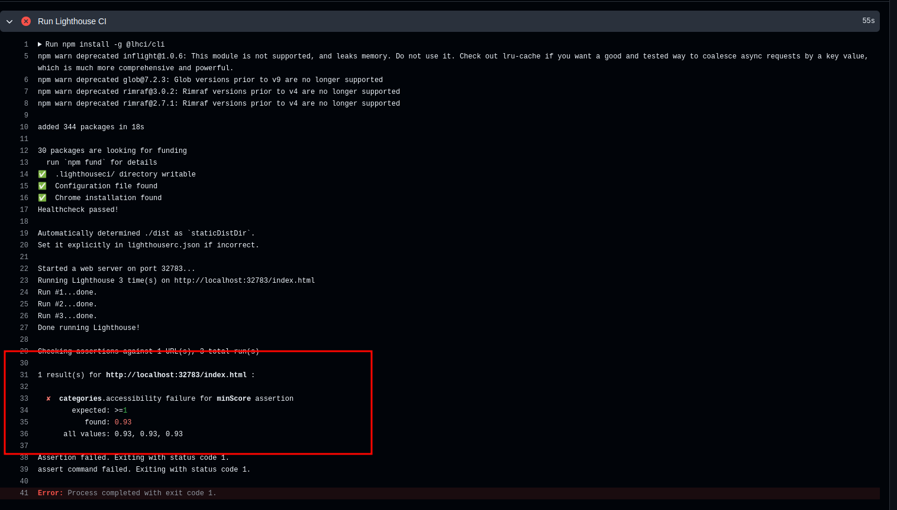
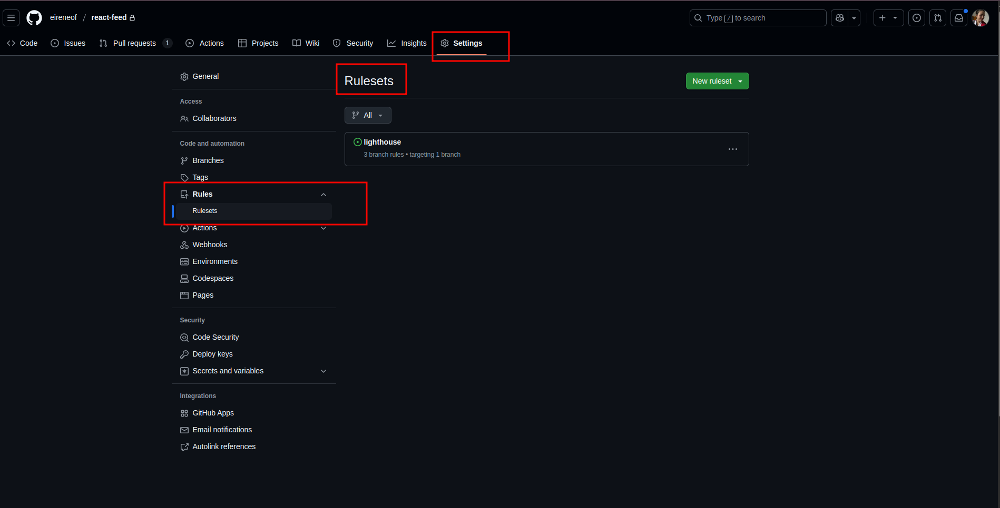
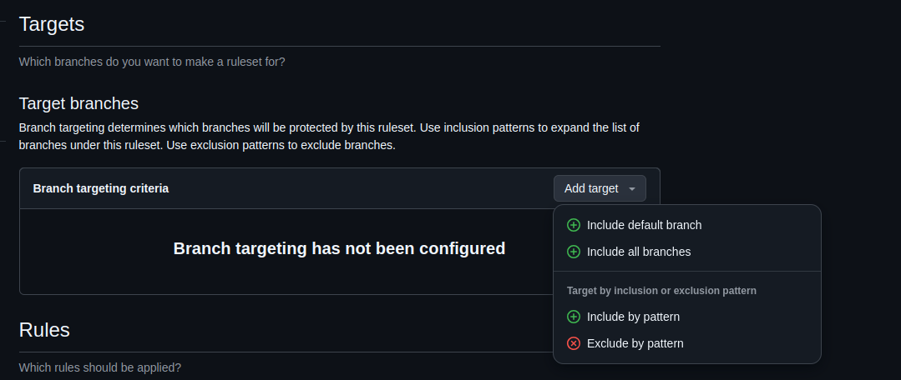
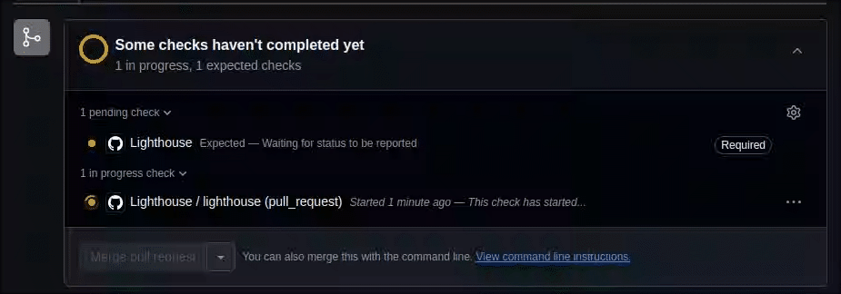

# Integrando lighthouse-ci com GitHub Actions no seu projeto

Este tutorial foi feito utilizando as seguintes configurações:
- **React** versão 19.0.0 com **TypeScript** versão 5.7.2
- **Node** v22.13.1
- **VS Code**
- **Git** e **Github**

## Introdução

Este é um tutorial relativamente simples, o objetivo é: **Se o código atingir X% de acessibilidade na auditoria de lighthouse ele pode ser publicado, caso contário, não pode.**

## Criando validacao

1. **Abra seu projeto no editor de código de dua preferência**
2.  **Adicione um arquivo de workflow do GitHub Actions:** Crie um arquivo YAML dentro da pasta `.github/workflows` no seu repositório GitHub (ex: `.github/workflows/lighthouse.yml`). Caso a pasta nao exista, crie ela.



3.  **Configure o workflow:** Defina os passos do seu workflow no arquivo YAML para:
    * Definir o gatilho para validação (push ou pull request por exemplo)
    *  Baixar e rodar o seu código do seu repositório no ambiente de CI.
    *   **Executar o lighthouse-ci:** 

```yaml
name: Lighthouse
on: # Define quando o workflow será executado
  pull_request:
    branches:
      - main # Apenas na branch "main" (branch principal)
  push: # Executar em cada push de código
    branches:
      - main # Apenas na branch "main" (branch principal)
jobs: # Define os jobs (tarefas) do workflow
  lighthouse: # Job para verificação de acessibilidade
    runs-on: ubuntu-latest
    steps:
      - uses: actions/checkout@v4
        with:
          fetch-depth: 0
      - name: Install dependencies
        run: npm ci
      - name: Build the project
        run: npm run build
      - name: Run Lighthouse CI # Executar o lighthouse-ci
        run: |
          npm install -g @lhci/cli
          lhci autorun
```

4.  **Defina o score mínimo de acessibilidade:** Crie um arquivo chamado `.lighthouserc.json` na raiz do seu projeto com a seguinte configuracao:

```json
{
  "ci": {
    "assert": {
      "assertions": {
        "categories:accessibility": [
            "error", //fará com que o comando retorne um código de erro se a auditoria falhar
            { "minScore": 1 } // define score mínimo como 100% para a categoria acessibilidade
            ]
      }
    }
  }
}
```


5.  Salve e suba as alterações para seu repositorio GitHub.
6.  **Verifique os resultados no GitHub Actions:** A partir de agora, a cada push ou Pull Request na branch configurada, o workflow de "Accessibility Check" será executado automaticamente. Você poderá visualizar sua execução no painel do GitHub Actions do seu repositório. Se o score de acessibilidade for inferior ao limite definido, o workflow irá falhar. 



## Configurando projeto para impedir PRs em que a validacao do lighthouse nao funcione

1. Entre na página do seu repositorio pelo github
2. Acesse a aba Settings > Rules > Rulesets

3. Clique em "New Ruleset" > New branch ruleset
4. De um nome para a sua regra "Ruleset Name" (ex: lighthouse check)
3. Inclua as branchs que vc quer que tenham essa regra

4. Marque a opcao "Require status checks to pass"
5. Dentro da op;'ao selecionada clieque em "Add checks" e digite "lighthouse". Clique em uma das op;'oes que aparecer com "Github Actions"

6. Clique em "Create"
7. Valide o funcionamento da sua regra e fim =)


---

### Referências e Material de Apoio

- [Medium | Google Lighthouse: do DevTools ao CI/CD](https://andrewrosario.medium.com/google-lighthouse-do-devtools-ao-ci-cd-67b00112cbda)
- [Github | GoogleChrome/lighthouse-ci](https://github.com/GoogleChrome/lighthouse-ci/tree/main)