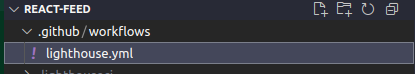
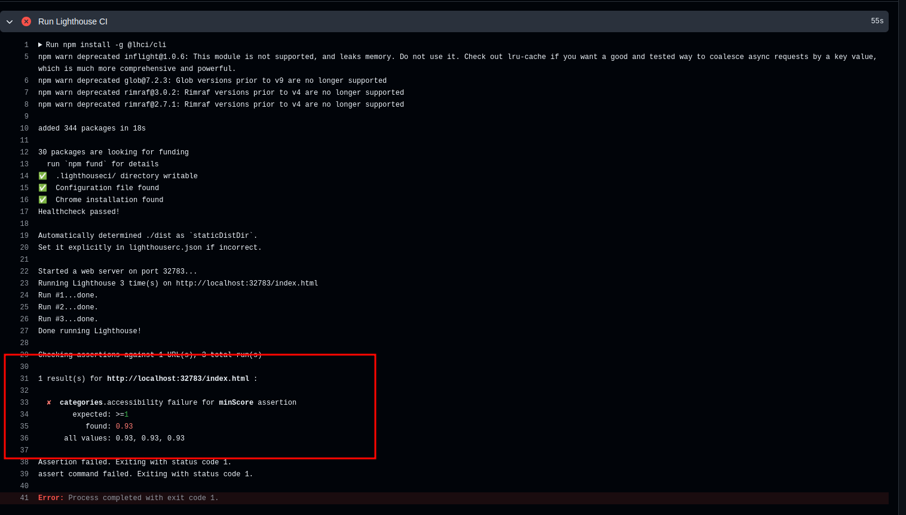
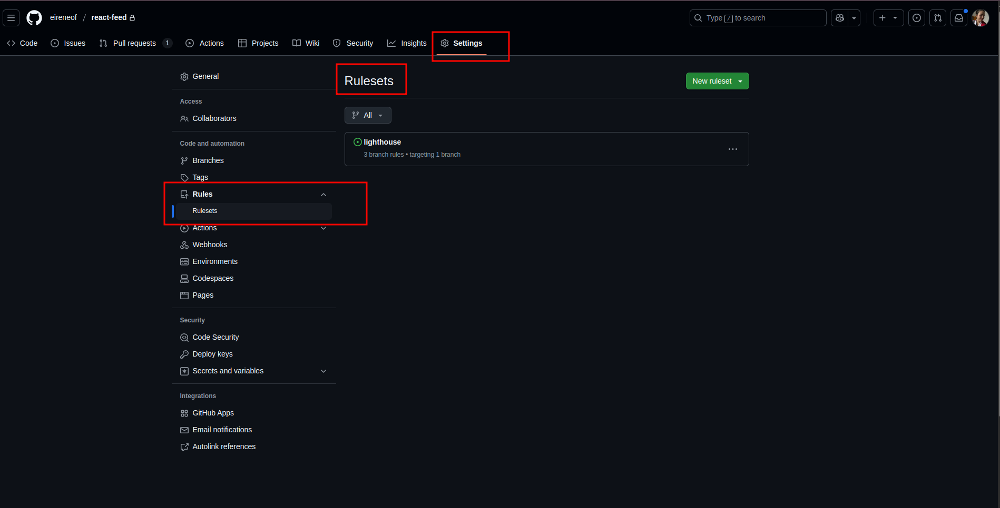
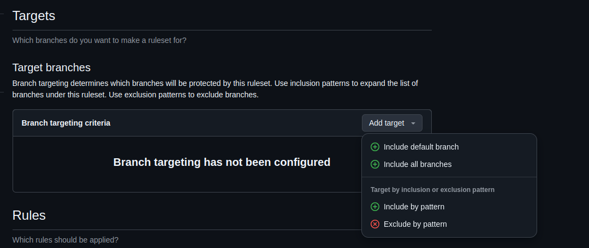

# Integrando Lighthouse CI com GitHub Actions no seu projeto

Este tutorial foi elaborado utilizando as seguintes configurações:

- **React** versão 19.0.0 com **TypeScript** versão 5.7.2
- **Node.js** v22.13.1
- **VS Code**
- **Git** e **GitHub**

## Introdução

Este é um tutorial relativamente simples. O objetivo é: **Se o código atingir X% de acessibilidade na auditoria do Lighthouse, ele pode ser publicado; caso contrário, não pode.**

## Criando a validação

1. **Abra seu projeto no editor de código de sua preferência.**
2. **Adicione um arquivo de workflow do GitHub Actions:** Crie um arquivo YAML dentro da pasta `.github/workflows` no seu repositório GitHub (exemplo: `.github/workflows/lighthouse.yml`). Caso a pasta não exista, crie-a.

    

3. **Configure o workflow:** Defina os passos do seu workflow no arquivo YAML para:
    - Definir o gatilho para validação (push ou pull request, por exemplo).
    - Baixar e rodar o código do seu repositório no ambiente de CI.
    - **Executar o Lighthouse CI:**

    ```yaml
    name: Lighthouse
    on: # Define quando o workflow será executado
      pull_request:
         branches:
            - main # Apenas na branch "main" (branch principal)
      push: # Executar em cada push de código
         branches:
            - main # Apenas na branch "main" (branch principal)
    jobs: # Define os jobs (tarefas) do workflow
      lighthouse: # Job para verificação de acessibilidade
         runs-on: ubuntu-latest
         steps:
            - uses: actions/checkout@v4
              with:
                 fetch-depth: 0
            - name: Install dependencies
              run: npm ci
            - name: Build the project
              run: npm run build
            - name: Run Lighthouse CI # Executar o Lighthouse CI
              run: |
                 npm install -g @lhci/cli
                 lhci autorun
    ```

4. **Defina o score mínimo de acessibilidade:** Crie um arquivo chamado `.lighthouserc.json` na raiz do seu projeto com a seguinte configuração:

    ```json
    {
      "ci": {
         "assert": {
            "assertions": {
              "categories:accessibility": [
                 "error", // Fará com que o comando retorne um código de erro se a auditoria falhar
                 { "minScore": 1 } // Define o score mínimo como 100% para a categoria acessibilidade
              ]
            }
         }
      }
    }
    ```

5. Salve e envie as alterações para o seu repositório GitHub.
6. **Verifique os resultados no GitHub Actions:** A partir de agora, a cada push ou pull request na branch configurada, o workflow de "Accessibility Check" será executado automaticamente. Você poderá visualizar sua execução no painel do GitHub Actions do seu repositório. Se o score de acessibilidade for inferior ao limite definido, o workflow irá falhar.





## Configurando o projeto para impedir PRs em que a validação do Lighthouse não funcione

1. Acesse a página do seu repositório no GitHub.
2. Vá até a aba **Settings > Rules > Rulesets**.



3. Clique em **New Ruleset > New branch ruleset**.
4. Dê um nome para a sua regra em "Ruleset Name" (exemplo: Lighthouse Check).
5. Inclua as branches que você deseja que tenham essa regra.



6. Marque a opção **Require status checks to pass**.
7. Dentro da opção selecionada, clique em **Add checks** e digite "lighthouse". Escolha uma das opções que aparecer com "GitHub Actions".


8. Clique em **Create**.
9. Valide o funcionamento da sua regra e pronto! 🎉


## Considerações Importantes ⚠️

Este guia oferece uma **introdução** simplificada à integração do Lighthouse CI com o GitHub Actions para monitorar a acessibilidade do seu projeto. O Lighthouse oferece uma vasta gama de configurações para acessibilidade, como a geração de relatórios e log de erros, mas também vai além da acessibilidade e analisa questões de boas práticas, SEO e performance.

> **Dica:** Analise as vastas possibilidades que você pode encontrar ao utilizar o Lighthouse CI! 😉

Buscar uma pontuação de 100% em acessibilidade é uma meta ambiciosa que demanda um esforço contínuo. O ideal é começar com metas incrementais, aumentando **gradualmente** a exigência de acessibilidade à medida que a sua compreensão e a do seu time sobre o tema evoluem. Explore as diversas opções do Lighthouse CI para otimizar ainda mais a qualidade do seu código em todos os aspectos.

🎉 **Parabéns por ter chegado até o fim deste tutorial! (que também é o último desta documentação, pelo menos por hora rs)** 🎉

Caso este tutorial tenha te ajudado de alguma forma, **nos ajude a melhorar este projeto respondendo ao nosso [formulário de feedback](https://forms.gle/U75FJSutNxZ2bwWG7). 😄**

---

### Referências e Material de Apoio

- [Medium | Google Lighthouse: do DevTools ao CI/CD](https://andrewrosario.medium.com/google-lighthouse-do-devtools-ao-ci-cd-67b00112cbda)
- [GitHub | GoogleChrome/lighthouse-ci](https://github.com/GoogleChrome/lighthouse-ci/tree/main)
