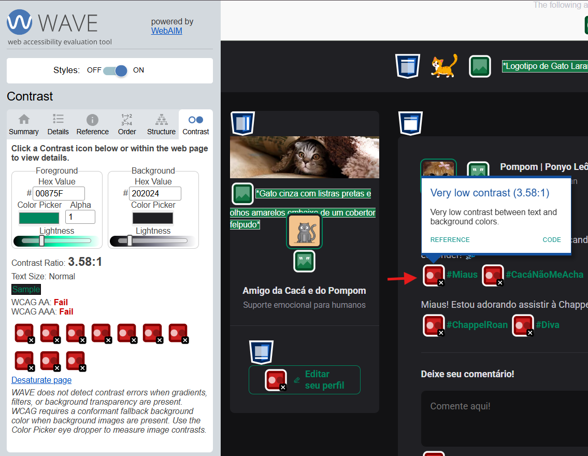
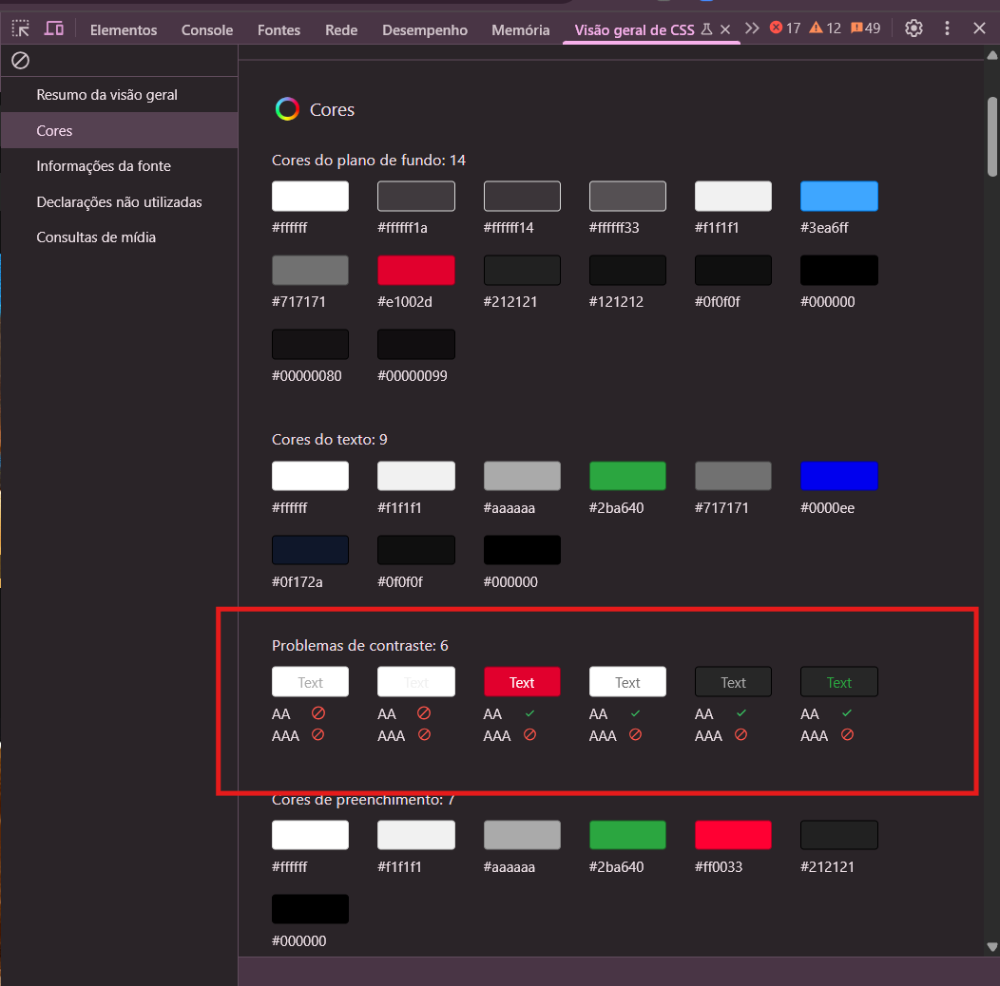
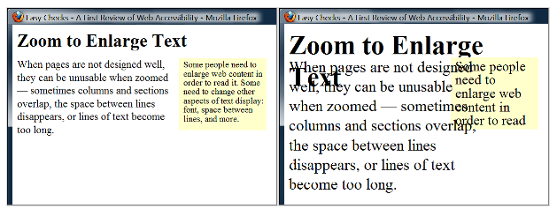

# Tutorial: Prepare sua Entrega com Testes Manuais de Acessibilidade Web

Este tutorial foi elaborado utilizando a seguinte configuração:
- 🌐 **Navegador:** Chrome

## O que são os testes propostos neste tutorial?

- **Navegação por Teclado:** Testar se é possível usar o site sem o mouse, apenas com o teclado.
- **Compatibilidade com Leitores de Tela:** Testar se um programa especial chamado leitor de tela (usado por pessoas cegas ou com baixa visão) consegue entender e ler o conteúdo do site em voz alta.
- **Inspeção Visual (Uso de cores, zoom e redimensionamento, entre outros):** Observar o site para identificar problemas de contraste, cores e fluidez do layout.
- **Acessibilidade de Multimídia:** Garantir que vídeos, áudios, imagens e animações no site sejam acessíveis para diferentes perfis de usuários.

Existem outros tipos de testes de acessibilidade que podem ser realizados para garantir uma cobertura ainda maior. No entanto, para o objetivo deste guia, que é ser simples e prático para desenvolvedores, focaremos nestes quatro tipos de testes. Eles já são suficientes para garantir um nível considerável de acessibilidade para sua entrega. Mas não se prenda a eles! 😉

---

## Testando Navegação por Teclado

- **Documentação de referência:** [WebAIM | Keyboard Accessibility](https://webaim.org/techniques/keyboard/)

### 1. Relembrando alguns comandos

Pode parecer óbvio, mas para testar a navegação pelo teclado, é necessário conhecer os comandos básicos de navegação. Os principais comandos que você precisará usar são:

- `Tab`: Avançar
- `Shift` + `Tab`: Retornar
- `Enter`: Ativar ou "clicar" no elemento focado.

### 2. Validando a navegação

Agora que você está mais familiarizado com os comandos básicos descritos anteriormente, utilize a tabela abaixo para explorar as interações disponíveis. Durante a navegação, observe se o comportamento dos elementos está de acordo com o esperado e com as notas fornecidas.

| Interação                        | Teclas                                                                 | Notas                                                                                                                                                                                                                                   |
|----------------------------------|------------------------------------------------------------------------|----------------------------------------------------------------------------------------------------------------------------------------------------------------------------------------------------------------------------------------|
| Navegar para elementos interativos | `Tab` - navegar para frente   `Shift` + `Tab` - navegar para trás | Indicadores de foco do teclado devem estar presentes.   A ordem de navegação deve ser lógica e intuitiva.                                                                                                                              |
| Link                             | `Enter` - ativar o link                                                |                                                                                                                                                                                                                                         |
| Botão                            | `Enter` ou `Barra de espaço` - ativar o botão                          | Garanta que elementos com ARIA `role="button"` possam ser ativados com ambos os comandos de tecla.                                                                                                                                      |
| Caixa de seleção (Checkbox)      | `Barra de espaço` - marcar/desmarcar uma caixa de seleção              | Usuários geralmente podem selecionar zero, uma ou múltiplas opções de um grupo de caixas de seleção.                                                                                                                                   |
| Botões de opção (Radio buttons)  | `Barra de espaço` - selecionar a opção focada (se não selecionada)   `↑`/`↓` ou `←`/`→` - navegar entre opções   `Tab` - sair do grupo de botões de opção | Usuários podem selecionar apenas uma opção de um grupo de botões de opção.                                                                                                                                                             |
| Menu suspenso (Select/Dropdown)  | `↑`/`↓` - navegar entre opções   `Barra de espaço` - expandir   `Enter`/`Esc` - selecionar opção e recolher | Você também pode filtrar ou pular para opções no menu ao digitar letras.                                                                                                                         |
| Autocompletar                    | Digite para começar a filtrar   `↑`/`↓` - navegar para uma opção   `Enter` - selecionar uma opção |                                                                                                                                                                                                                                         |
| Diálogo (Dialog)                 | `Esc` - fechar                                                         | Diálogos modais devem manter o foco do teclado.   Diálogos não modais devem fechar automaticamente quando perdem o foco.   Quando um diálogo fecha, o foco geralmente deve retornar ao elemento que abriu o diálogo.                 |
| Controle deslizante (Slider)     | `↑`/`↓` ou `←`/`→` - aumentar ou diminuir o valor   `Home`/`End` - início ou fim | Para controles deslizantes de duas pontas (para definir um intervalo), `Tab`/`Shift` + `Tab` devem alternar entre cada ponta.   Em alguns controles deslizantes, `PageUp`/`PageDown` podem mover em incrementos maiores (ex.: 10%). |
| Barra de menu                    | `↑`/`↓` - opção de menu anterior/próxima   `Enter` - expandir o menu (opcional) e selecionar uma opção.   `←`/`→` - expandir/recolher submenu | Uma barra de menu altera dinamicamente o conteúdo dentro de uma aplicação. Links que utilizam `Tab`/`Enter` NÃO são barras de menu.                                                                                                  |
| Painel de abas (Tab panel)       | `Tab` - uma vez para navegar para dentro do grupo de abas e outra para navegar para fora   `↑`/`↓` ou `←`/`→` - escolher e ativar aba anterior/próxima. | Isso é para abas de 'aplicação' que alteram dinamicamente o conteúdo dentro do painel. Se um menu parece um grupo de abas, mas é um grupo de links para páginas diferentes, `Tab` e `Enter` são mais apropriados.                    |
| Menu em árvore ('Tree' menu)     | `↑`/`↓` - navegar opção anterior/próxima   `←`/`→` - expandir/recolher submenu, mover um nível acima/abaixo. |                                                                                                                                                                                                                                         |
| Rolagem (Scroll)                 | `↑`/`↓` - rolar verticalmente   `←`/`→` - rolar horizontalmente   `Barra de espaço`/`Shift` + `Barra de espaço` - rolar por página | A barra de espaço, por padrão, rolará a página, mas apenas se um controle interativo que permite entrada pela barra de espaço não estiver focado.   A rolagem horizontal dentro da página deve ser minimizada.                       |

_Fonte: [WebAIM | Keyboard Accessibility](https://webaim.org/techniques/keyboard/) tabela acessada em 08/04/2025_

### 3. Check dos seguintes itens

Após testar a navegação simulando um usuário padrão, garanta que os seguintes pontos estão sendo cumpridos:

- ✅ **Teste de Tabulação:** Usando a tecla `Tab` para navegar por todos os elementos interativos da página (links, botões, campos de formulário, etc.). A ordem de foco é lógica e segue o fluxo visual da página.
- ✅ **Teste de Tabulação Inversa:** Usando `Shift` + `Tab` para navegar para trás pelos elementos interativos. A ordem permanece lógica.
- ✅ **Ativação por Teclado:** Todos os elementos interativos podem ser ativados usando as teclas `Enter` ou `Espaço` (dependendo do elemento).
- ✅ **Indicador de Foco:** Um indicador de foco claro e visível aparece em cada elemento interativo quando ele recebe o foco do teclado.
- ✅ **Armadilhas de Teclado:** NÃO há "armadilhas de teclado" onde o foco fica preso em um elemento e não pode ser movido para fora usando o teclado.

<!-- ### Compatibilidade com Leitores de Tela:

Teste com um Leitor de Tela: Use um leitor de tela (como NVDA, VoiceOver ou TalkBack) para navegar pela página.
Conteúdo Significativo: Verifique se todo o conteúdo significativo da página é lido pelo leitor de tela em uma ordem lógica.
Texto Alternativo para Imagens: Certifique-se de que todas as imagens não textuais possuem texto alternativo (alt) descritivo e informativo.
Rótulos de Formulário: Verifique se todos os campos de formulário têm rótulos (label) associados corretamente e que são lidos pelo leitor de tela.
Tabelas de Dados: Certifique-se de que as tabelas de dados são marcadas semanticamente com <th> para cabeçalhos de coluna e linha, permitindo que os leitores de tela anunciem as associações de dados corretamente.
ARIA (Accessible Rich Internet Applications): Inspecione o uso de atributos ARIA para melhorar a acessibilidade de conteúdo dinâmico e widgets complexos. Verifique se eles são usados corretamente para fornecer informações adicionais aos leitores de tela.
Mensagens de Erro: Teste se as mensagens de erro em formulários são anunciadas pelos leitores de tela e são fáceis de entender.
Links de Pular Conteúdo: Verifique se há links de "pular para o conteúdo principal" ou similares que permitam aos usuários de leitores de tela ignorar a navegação repetitiva. -->

---

## Inspeção Visual

> 📌 Em projetos pessoais ou autônomos temos maior liberdade de atuar na correção de problemas de layout. No entanto, em equipes onde decisões de layout não são de sua responsabilidade, comunique o problema à pessoa apropriada. Mesmo que a solução não seja imediata, é importante que o problema seja registrado pela equipe ou empresa.

### A. Verifique o Contraste de Cores

- **Documentação de referência:** [web.dev | Como testar o contraste de cores do design da Web](https://web.dev/articles/testing-web-design-color-contrast?hl=pt-br)

Para garantir a acessibilidade, utilize o [Wave](./Wave.md) ou [DevTools](./devtools.md) conforme vimos anteriormente. Mas também, sinta-se livre para usar a ferramenta de sua escolha para uma última verificação do contraste de cores antes da entrega do código.

**Wave:**

**DevTools (CSS Overview):**

**Objetivo:** 
- ✅ Avaliar se há contraste suficiente entre o texto, ícones, imagens e o fundo para garantir a legibilidade para usuários com deficiências visuais.

### B. Verifique o Uso de Cores

- **Documentação de referência:** [AcessGuide | Don't use color alone to convey information (colorblind)](https://www.accessguide.io/guide/colorblind)

![Imagem comparativa entre duas interfaces de formulário para criação de senha. À esquerda, está a versão rotulada como "usuário típico", com os campos "Nova senha" em verde e "Confirmar nova senha" em vermelho, indicando visualmente correção ou erro. À direita, a versão para "usuário com tipo de daltonismo", em que ambos os textos e bordas dos campos aparecem em tonalidades similares amarronzadas, dificultando a distinção entre certo e errado apenas pela cor. Ambas as interfaces possuem um botão preto com o texto "Criar nova senha". ](../../assets/exemplo_daltonismo.png)
_Fonte: [AcessGuide | Don't use color alone to convey information (colorblind)](https://www.accessguide.io/guide/colorblind) imagem acessada em 09/04/2025_

**Objetivo:** 

- ✅ Verificar se a cor não é o único meio de transmitir informações importantes. Certifique-se de que há alternativas textuais ou visuais para usuários que não conseguem perceber cores.

### C. Verifique o Zoom e Redimensionamento da página

Aqui você deve verificar se o conteúdo da página se ajusta corretamente ao aumentar o zoom, sem quebrar o layout ou exigir rolagem horizontal excessiva.

**Como Testar?**

- **Aumentar o Zoom:** Pressione e segure a tecla `Ctrl` (ou `Command` no Mac) e pressione a tecla `+` (sinal de mais) repetidamente até atingir o nível de zoom desejado (experimente 200% ou mais).
- **Diminuir o Zoom:** Pressione e segure a tecla `Ctrl` (ou `Command` no Mac) e pressione a tecla `-` (sinal de menos).
- **Voltar ao Zoom Padrão:** Pressione e segure a tecla `Ctrl` (ou `Command` no Mac) e pressione a tecla `0` (zero).

> 💡 **Dica:** Teste em diferentes níveis de zoom (150%, 200%, 300%) para garantir que seu site funcione bem em diversas situações.

- **Redimensionamento:** Redimensione a janela do navegador para diferentes tamanhos para garantir que o conteúdo seja responsivo e não seja cortado ou obscurecido.

> 💡 **Dica:** As DevTools também oferecem uma maneira de simular diferentes tamanhos de layout. Se não souber como fazer, confira o tutorial do Chrome for Developers: [Simular dispositivos móveis com o modo dispositivo](https://developer.chrome.com/docs/devtools/device-mode?hl=pt-br)

_Fonte: [W3C | Resize text](https://www.w3.org/WAI/test-evaluate/preliminary/#resize) imagem acessada em 09/04/2025_

**Objetivos:**

- ✅ **Reflow de Conteúdo:** O texto e outros elementos da página devem se reorganizar para caber na tela sem que você precise rolar horizontalmente para ler o conteúdo principal.
- ✅ **Legibilidade:** O texto deve permanecer legível mesmo com o zoom aumentado.
- ✅ **Sem Quebras:** O layout geral da página não deve quebrar de forma significativa, tornando a navegação confusa.

---

## Acessibilidade de Multimídia

### 1. Imagens

- ✅ **Texto Alternativo (Alt Text):** Todas as imagens devem ter um texto alternativo que descreva seu conteúdo e função. Caso a imagem seja decorativa, deixe o `alt` vazio (`alt=""`).
- ✅ **Imagens Complexas:** Para imagens complexas como gráficos e diagramas, considere fornecer uma descrição mais detalhada no texto adjacente ou através de um link para uma página com a descrição completa.

### 2. Vídeos

- ✅ **Legendas para Vídeos:** Verifique se todos os vídeos têm legendas sincronizadas para usuários surdos ou com deficiência auditiva.
- ✅ **Audiodescrição para Vídeos:** Para vídeos onde o conteúdo visual é essencial para o entendimento, verifique se há audiodescrição disponível.

### 3. Áudios

- ✅ **Transcrições para Áudios:** Certifique-se de que todos os conteúdos de áudio têm transcrições textuais disponíveis.

### 4. Animações

- ✅ **Conteúdo Piscando ou em Movimento:** Verifique se há elementos piscando ou em movimento rápido que possam causar convulsões em alguns usuários. Idealmente, esses elementos devem ser evitados ou ter mecanismos para pausar ou interromper a animação.
- ✅ **GIFs ou Animações:** Caso haja GIFs ou animações, eles devem ter mecanismos para pausar ou interromper a animação.

### 5. Controles

- ✅ **Controles de Multimídia:** Certifique-se de que os controles de reprodução (play, pause, volume, etc.) são acessíveis via teclado e leitor de tela.

### 6. Links

- ✅ **Texto Descritivo:** O texto do link deve ser claro e indicar o destino do link. Evite frases genéricas como "Clique aqui".
- ✅ **Distinção Visual:** Os links devem ser visualmente distintos do texto ao redor (por exemplo, através de cor e/ou sublinhado).
- ✅ **Atributo `title` (Opcional, mas útil):** Considere adicionar um atributo `title` aos links para fornecer informações adicionais sobre o destino, especialmente se o texto do link for breve.
- ✅ **Foco Visível:** Ao navegar com o teclado, deve haver um indicador visual claro de qual link está selecionado.

### 7. Ícones

- ✅ **Ícones com Significado:** Se um ícone é usado para transmitir informações importantes, ele deve ter um texto alternativo que descreva seu significado. Alternativamente, o significado do ícone pode ser explicitado em texto adjacente.
- ✅ **Ícones Decorativos:** Ícones puramente decorativos podem ter um texto alternativo vazio (`alt=""`).
- ✅ **Contraste:** Certifique-se de que o contraste de cores dos ícones seja suficiente para que sejam facilmente visíveis.

---

Parabéns por ter chegado até o fim deste tutorial. Estes testes manuais são projetados para serem **simples e rápidos**, permitindo que você, como **desenvolvedor**, faça uma verificação inicial antes de cada entrega. 

Embora existam outros aspectos importantes da acessibilidade, os testes mencionados aqui visam garantir um nível mínimo de acessibilidade. **Além disso, eles oferecem a oportunidade de você se colocar no lugar do usuário, complementando a avaliação de ferramentas automatizadas com sua própria experiência e percepção.**

Caso este tutorial tenha te ajudado de alguma forma, **nos ajude a melhorar este projeto respondendo ao nosso [formulário de feedback](https://forms.gle/U75FJSutNxZ2bwWG7). 😄**

---

### Material de apoio e Referência

- [W3C | Easy Checks – A First Review of Web Accessibility](https://www.w3.org/WAI/test-evaluate/preliminary/)
